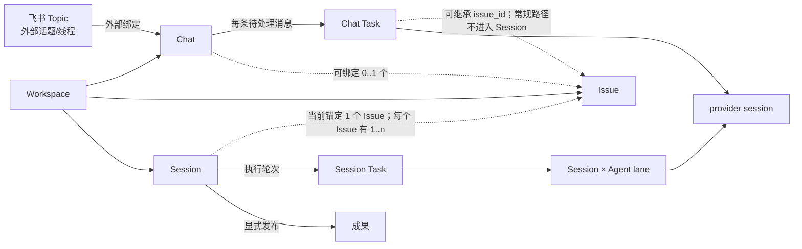

# Topic、Chat 与 Session

本页是 Remi 对这些名称的产品约定。**Session 是 Remi 的核心领域概念**，与 Chat、Issue、Task
并列拥有稳定身份和生命周期；不能把它定义成 Issue 页面中的一个附属标签，也不能只在 Issue 上下文中
才承认它是 Session。当前实现要求每个 Session 关联且只关联一个 Issue，这是目标、权限和工作区的强制锚点，
不是 Session 的身份。`provider session` 必须带限定词，不能简称为 Session。



## 名词与关系

| 名称 | 产品职责 | 持久化和关系 |
|---|---|---|
| Topic | 特指飞书群中的原生话题/线程，是消息接入的外部地址，不是 Remi 的一级领域对象。 | 以飞书 `chat_id` 和根消息 ID 组成外部会话键，经 binding 指向一个 Chat。 |
| Chat | 用户与一个 Agent 的持续对话容器，保存消息、队列、未读状态和运行上下文；不要求先有 Issue。 | 属于 Workspace，固定一个 Agent，可选绑定一个同 Workspace Issue。一个 Issue 可被多个 Chat 绑定。 |
| Session | 有稳定 ID、事件投影和独立 Agent 上下文的持久工作脉络，是 Remi 的核心领域对象。 | 属于 Workspace；当前必须关联且只关联一个同 Workspace Issue，不能改绑。一个 Issue 有一个默认 Session，并可关联多个附加 Session。 |
| Issue | 要跟踪、分派和验收的工作目标，也是当前 Session 的目标、权限及工作区锚点。 | 属于 Project/Workspace；创建时同步创建唯一的默认 `Main` Session。删除 Issue 会级联删除关联 Session。 |
| Task | 一次可调度、可取消、可审计的执行轮次，不是对话或工作上下文。 | Chat 消息创建 Chat Task；Session 派发创建 Session Task；也存在不属于二者的直接 Task。 |
| 成果（Session Result） | 某个 Session 主动发布、供其关联 Issue 范围复用的稳定结论或交付物。 | 不可变，记录来源 Session、可选来源 Task、类型和引用；不等同于完整事件或 Task transcript。 |
| provider session | Codex/Claude 等运行后端用于续接模型上下文的技术标识。 | Chat 直接保存当前续接状态；Session 按 `Session × Agent × execution scope` 保存 lane。它不是产品 Session。 |

实现依据包括 [Issue/Session 表结构](../packages/server/src/store/migrations.ts)、
[Session 仓储](../packages/server/src/store/repos/issue-sessions-repo.ts)、
[Chat 仓储](../packages/server/src/store/repos/chat-repo.ts)和
[Task 调度](../packages/server/src/store/repos/tasks-repo.ts)。Session 表使用全局稳定主键，并拥有自己的状态、
参与者、追加事件、Agent lane 和成果；`issue_id` 是必填关联键，CLI 则以顶级 `remi session`
命令组管理它。当前 REST 路径
`/api/issues/:issueId/sessions`、数据库表名 `multiremi_issue_sessions` 和兼容类型
`MultiremiIssueSession` 反映现有访问路径或历史命名，不把 Session 降格为 Issue 的局部 UI 状态。
兼容类型 `MultiremiChatSession` 和 REST 路径 `/api/chat/sessions` 同样不表示 Chat 是 Session 的一种。

## 身份、创建与生命周期

### Session

- 创建 Issue 时自动创建默认 `Main` Session；额外 Session 由用户、API 或 CLI 显式创建，并在创建时
  选择其关联 Issue。当前没有“游离 Session”或把 Session 改绑到另一 Issue 的产品能力。
- Session 以自身 ID 作为身份。标题、`active`/`archived` 状态、参与者和摘要属于 Session；事件按
  Session 分流，同一个 Agent 在同一个 Session 内通过 lane 续接 provider 上下文，换 Session 或换
  Agent 都不是同一条 lane。
- `active`/`archived` 是 Session 自己的生命周期状态，当前用于组织和默认列表过滤。归档后默认列表
  隐藏该 Session；它不同于 Chat 归档，现有实现不会自动取消正在执行的 Task，也没有把所有写入口
  统一变为只读。
- 当前没有独立删除 Session 的入口。删除其关联 Issue 时，数据库按强制锚点级联清理 Session；这是
  当前生命周期约束，不改变 Session 在存续期间的独立身份。

### Chat

- Web 在首次发送消息或首次上传附件时创建 Chat；CLI 也可用 `remi chat create` 显式创建。
- 一条没有活跃执行的消息创建一个 Chat Task；已有活跃 Task 时，飞书接入可把新消息作为 steer
  送给该 Task。同一 Chat 的待执行 Task 串行领取。
- Chat 的 provider session 只是运行优化。不能续接时，系统可从有预算的 Chat 历史重新投影，
  因此 Chat 的身份不依赖某一个 provider session ID。
- 归档 Chat 会取消未完成 Task 并使它只读；恢复后可继续。删除会移除 Chat 及消息，并取消未完成 Task，
  但已保留的 Task 审计记录仍保留私聊作用域。

Chat 与 Session 是两种并列的持久上下文：Chat 面向持续人机对话和消息队列；Session 面向围绕目标的
工作脉络、协作事件和可复用成果。两者不互相包含，也不共享身份或生命周期。

### Task 与成果

- 正常 Chat 发送路径创建的 Task 具有 `chat_session_id`；如果 Chat 已绑定 Issue，还会继承
  `issue_id`，但不会自动取得 `issue_session_id`。因此它仍是 Chat Task，不会进入 `Main` Session。
- 正常 Session 执行路径创建的 Task 具有 `issue_id` 和 `issue_session_id`，没有 `chat_session_id`。
  其中 `issue_session_id` 决定工作上下文身份，`issue_id` 与 Session 的强制锚点保持一致；未显式指定
  Session 的 Issue 执行入口使用 `Main`。
- Task 完成输出仍是执行记录。只有调用 `remi session result publish`（或等价 API）后，才成为
  可由关联 Issue 中其他 Session 稳定复用的成果；其他 Session 不应依赖来源 Session 的私有事件投影。
- 成果保留 `source_session_id`，以 Session 作为来源身份；当前同时用 `issue_id` 建立 Issue 范围索引和
  访问边界。成果不会因普通 Task 完成或 transcript 存在而自动发布。
- Chat 绑定 Issue 只提供关联、上下文提示和 Issue 更新订阅，不会合并 Chat 与 Session 的消息历史、
  Task 队列、provider session 或生命周期。Chat Task 也不会自动发 Issue 评论或驱动 Issue 状态。

成果元数据约定见 [Issue key results](issue-key-results.md)，Chat 的队列与权限契约见
[Chat](chat.md)。

## 飞书个人 Bot 与群话题

[Feishu 连接器](../packages/connectors/src/feishu/index.ts)先计算外部会话键，
[FeishuBotRepo](../packages/server/src/store/repos/feishu-bot-repo.ts)再把它映射为平台 Chat：

| 飞书入口 | 外部会话键 | 产品行为 |
|---|---|---|
| 个人 Bot 私聊 | 私聊的 `chat_id` | 同一私聊持续映射到同一 Chat，直到执行 `/new` 或路由 Agent 改变。每条新输入创建/steer Task，而不是创建 Session。 |
| 群内新顶层消息 | `chat_id:thread:<message_id>` | 该根消息开启一个飞书 Topic，并映射到独立 Chat。 |
| 群内话题回复 | `chat_id:thread:<root_id>` | 继续同一飞书 Topic 对应的 Chat。 |
| Remi 自动创建的 Issue 话题 | 发送成功后的根消息 ID | 预先创建的绑定 Chat 在根消息落地后固定外部键，并可选绑定对应 Issue。 |

`/new` 会取消当前活跃 Task 并解除该外部键的 binding；下一条消息创建新 Chat。旧 Chat 不会因
`/new` 自动归档或删除。在飞书中用 `/chat` 查看当前 Chat。旧 `/sessions` 命令仅为兼容而返回当前
Chat，并显示弃用提示；它不查询或列出产品 Session。

Daemon 在飞书 Topic 尚未转成 Issue 时，可能使用 `_topics/<topic-id>` 临时工作目录；
[TopicWorkspaceLifecycle](../packages/daemon/src/agent-runtime/workspace/topic-lifecycle.ts)在 Issue 创建后把它迁移到
Issue 工作目录。`remi issue bind-topic` 是该迁移的恢复入口。这里的 “topic workspace” 是本地实现细节，
不是另一种产品对象或长期容器。

## 术语规则与关联事项

- UI、文档和 CLI 用 **Chat** 指持续对话，用 **Session** 指核心工作上下文，用 **Task** 指一次执行；
  不要使用 “Chat Session”，也不要把 “Issue Session” 作为产品名称。需要说明当前约束时，写成
  “与 Issue 关联的 Session”。
- 数据库列 `chat_session_id`、类型 `ChatSession`、URL 查询参数 `?session=`、REST
  `/api/chat/sessions`，以及 Session 的 `issue_session_id`、`MultiremiIssueSession` 和嵌套 REST 路径
  暂时保留兼容，不作为新产品术语扩散。
- “Session archive” 还可能指 provider 本地会话文件的备份/恢复机制；必须写全为
  **provider session archive**，不要与产品 Session 的 `archived` 状态混用。
- Workspace 单用户模型、成员/owner 清理与外部发送者身份边界由 **MUL-2** 独立处理，本页不定义其迁移方案。
- 让绑定 Issue 的 Chat 直接展示并续接 Session Task 由 **MUL-3** 独立处理；在该能力完成前，
  不得把 Chat-Issue 绑定描述为 Chat 与 Session 的合并。

## 验证入口

核心关系由以下测试覆盖：

```bash
bun test tests/unit/multiremi/multiremi-issue-sessions.test.ts
bun test tests/unit/multiremi/multiremi-store-chat.test.ts tests/unit/multiremi/chat-queue.test.ts
bun test tests/unit/multiremi/multiremi-feishu-bot-task-bridge.test.ts
bun test tests/unit/daemon/topic-workspace-lifecycle.test.ts
```
