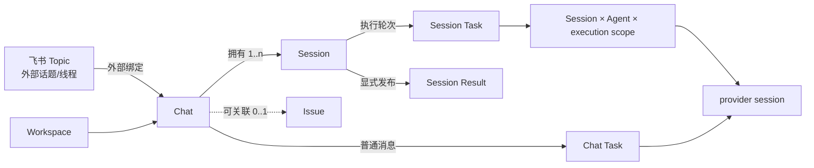

# Topic、Chat 与 Session

本页是 Remi 的权威产品约定。**Session 是核心领域对象，并且由 Chat 拥有；Issue 不是 Session 的必备父对象。**
`provider session` 必须带限定词，不能简称为 Session。



## 名词、身份与基数

| 名称 | 产品职责 | 持久化关系 |
|---|---|---|
| Topic | 飞书群原生话题/线程，是消息接入地址，不是 Remi 一级对象。 | 飞书 `chat_id` 与根消息 ID 组成外部键，经 binding 指向 Chat。 |
| Chat | 用户与一个 Agent 的持续对话及工作入口，保存消息、队列、未读状态和工作位置。 | 属于 Workspace，固定一个 Agent，拥有 1..n Session，可选关联 0..1 个同 Workspace Issue。 |
| Session | 有稳定 ID、状态、参与者、追加事件、独立 Agent lane 和成果的持久工作脉络。 | 必须属于且只属于一个 Chat；默认 `Main` 在 Chat 创建时建立，同一 Chat 可再建多个 Session。 |
| Issue | 对部分工作进行跟踪、分派和验收的管理锚点。 | Chat 可升级/关联到 Issue；一个 Issue 可关联多个 Chat，因而聚合这些 Chat 的 Session。Issue 不拥有 Session。 |
| Task | 一次可调度、可取消、可审计的执行轮次。 | 普通 Chat Task 只有 Chat 上下文；Session Task 同时记录所属 Chat 与 Session，并可快照当时的 Issue。 |
| Session Result | Session 显式发布的不可变成果。 | 始终记录来源 Chat/Session，可选记录来源 Task；Issue 只在关联存在时提供聚合视图。 |
| provider session | Codex/Claude 等后端的上下文续接标识。 | Chat 保存普通对话续接状态；Session 按 lane 保存。它不是产品 Session。 |

数据库表 `multiremi_issue_sessions`、列 `issue_session_id` 和兼容类型 `MultiremiIssueSession` 是历史命名，
不表达所有权。新契约使用 `Session.chat_id`；`issue_id` 是所属 Chat 当前关联 Issue 的可空兼容/索引值。
规范 API 位于 `/api/multiremi/chats/:chatId/sessions`，旧 `/api/issues/:issueId/sessions` 只提供受 Chat
访问控制约束的聚合兼容视图。

## 创建与生命周期

### Chat 与 Session

- 创建 Chat 时同步建立唯一默认 `Main` Session；额外 Session 从该 Chat 显式创建。创建 Issue 不再创建 Session。
- Session 的标题、`active`/`archived`、摘要、参与者、事件和 lane 独立存在。切换 Session 或 Agent 会切换 lane。
- Session 归档会隐藏该工作脉络并禁止创建新的 Session Task，但不等于 Chat 归档。Chat 归档会取消该 Chat 下尚未完成的普通 Chat Task
  与 Session Task；恢复 Chat 后，未单独归档的 Session 可继续使用。
- 删除 Chat 是显式破坏性操作：其消息、Session 事件及成果随所有者删除；Task 审计行保留，但 Chat/Session
  外键清空。删除或解绑 Issue 不删除 Chat、Session、Task 或成果。

### 关联或升级为 Issue

Chat 的 `issue_id` 是可选关联，不改变 Chat 或 Session 身份：

1. 普通 Chat 及其所有既有 Session 可在没有 Issue 时工作。
2. Chat 关联 Issue 后，所有 Session 立即出现在该 Issue 的“关联 Sessions”聚合视图；Session ID、事件、lane
   和成果来源不变。
3. 关联前创建的 Task 保留创建时的 `issue_id = null` 审计快照，不被重写为 Issue Task。关联后的新
   Session Task 同时记录 `chat_session_id`、`issue_session_id` 和当时的 `issue_id`。
4. 成果的所有权始终是 Chat/Session。关联 Issue 后可从 Issue 聚合查看；解绑后从该 Issue 视图消失，
   仍可从原 Chat/Session 访问。
5. Issue 聚合不得扩大私有 Chat 的可见性。兼容 Issue API 仍须先通过 Chat 创建者与 Agent 访问检查。

Chat 改绑/解绑 Issue 只更新当前关联索引，不合并 transcript、队列或 provider context，也不追溯修改历史 Task。

## Task、消息与成果边界

- 普通 Chat 消息继续创建/steer Chat Task；本次不把它自动路由进默认 Session。该交互演进属于 **MUL-3**。
- 普通 Chat 的 pending/queue/edit/prioritize/steer 入口只处理 Chat Task，不会选中或改写同一 Chat 下的 Session Task；
  Chat 归档/删除则会停止全部子 Task，以维持所有者生命周期边界。
- 飞书绑定 Issue 后既有的协调员 handoff 仍可显式创建或 steer 同 Chat、同 Issue 的 Session Task；这是受限的
  控制面兼容路径，不会把普通 Chat 输入、消息记录或队列自动并入 Session。
- 显式 Session Task 同时携带 Chat 与 Session 身份；Session 的 Issue 关联可空。归档的所属 Chat 不能再创建
  Session Task。
- Session message 是追加事件，不等同于 Issue 评论。只有 Chat 当前关联 Issue 且调用兼容 Issue message
  入口时，才同时形成 Issue 评论。
- Task 输出或完整 transcript 不自动成为成果。只有显式 publish 才创建 Session Result；跨 Session 复用
  应使用成果，而不是读取来源 Session 的私有事件。

## 存量迁移与兼容

升级迁移先放宽旧 `issue_id NOT NULL`，增加 `chat_id` 并改变级联语义：

- 若一个存量 Issue 恰好只绑定一个 Chat，旧 Session 及其 Task/成果可无歧义地自动归到该 Chat。
- 每个尚无默认 Session 的存量 Chat 补建 `Main`；这不改变普通 Chat message → Task 行为。
- 一个 Issue 没有 Chat 或绑定多个 Chat 时，迁移不猜测所有者。旧 Session 暂以 `chat_id = null` 保留在
  兼容 Issue API；它可读、可导出，但在显式归入 Chat 前不能创建新的 Session Task。
- SQLite 迁移在单事务中重建两张元数据表，迁移后执行外键检查；PostgreSQL 放宽非空约束并重建索引/外键。
  任一步失败都不会记录迁移完成标记。
- 旧 Issue 嵌套 REST、`IssueSession` 类型和 `remi issue session ...` 兼容入口可继续读取；新代码、CLI 与 UI
  使用 Chat 路径和 `Session` 名称。没有数据需要伪造占位 Issue。

## 飞书行为

| 飞书入口 | 外部会话键 | 产品行为 |
|---|---|---|
| 个人 Bot 私聊 | 私聊 `chat_id` | 同一私聊持续映射同一 Chat；Chat 创建时有 `Main` Session，但普通输入仍创建/steer Chat Task。 |
| 群顶层消息 | `chat_id:thread:<message_id>` | 根消息开启 Topic 并映射独立 Chat。 |
| 群 Topic 回复 | `chat_id:thread:<root_id>` | 续接同一 Topic/Chat。 |

`/new` 取消活跃 Task 并解除外部 binding；下一条消息创建新 Chat，旧 Chat 不自动删除。`/chat` 查看当前 Chat；
旧 `/sessions` 只是 Chat 查询别名，不列产品 Session。Daemon `_topics/<topic-id>` 是 Issue 建立前的临时目录，
`remi issue bind-topic` 是恢复入口，二者都不是产品 Topic 容器。

## 术语与范围

- 产品文案统一使用 **Chat**、**Session**、**Issue**、**Task** 和 **Session Result**。
- 不使用 “Chat Session” 或 “Issue Session” 作为产品名；需要限定时写“某 Chat 的 Session”或
  “当前关联到某 Issue 的 Session”。
- 本次不实施 **MUL-2** 的单用户 Workspace 重构，也不实施 **MUL-3** 的普通 Chat 消息到 Session Task
  路由；这里只固定它们将来必须遵守的所有权与接口边界。

## 验证入口

```bash
bun test tests/unit/multiremi/multiremi-issue-sessions.test.ts
bun test tests/unit/multiremi/multiremi-store-chat.test.ts
bun test tests/unit/multiremi/multiremi-feishu-bot-task-bridge.test.ts
npm run docs:test
npm run docs:check
```
