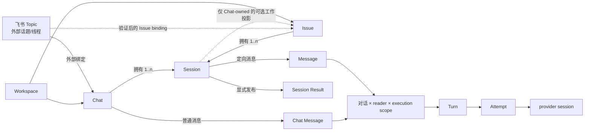

# Topic、Chat 与 Session

本页是 Remi 的权威产品约定。**每个 Session 恰好由一个 Chat 或一个 Issue 拥有。**
Chat-owned Session 可以关联一个 Issue；这个工作投影不改变 Session 的所有者。
`provider session` 必须带限定词，不能简称为 Session。


```mermaid
flowchart LR
  Topic["飞书 Topic<br/>外部话题/线程"] -->|外部绑定| Chat
  Workspace --> Chat
  Workspace --> Issue
  Chat -->|拥有 1..n| Session
  Issue -->|拥有 1..n| Session
  Session -. "仅 Chat-owned 的可选工作投影" .-> Issue
  Topic -. "验证后的 Issue binding" .-> Issue
  Session -->|定向消息| Message
  Session -->|显式发布| Result[Session Result]
  Chat -->|普通消息| ChatMessage[Chat Message]
  Message --> Lane["对话 × reader × execution scope"]
  ChatMessage --> Lane
  Lane --> Turn --> Attempt --> Provider[provider session]
```

## 名词、身份与基数

| 名称 | 产品职责 | 持久化关系 |
|---|---|---|
| Topic | 飞书群原生话题/线程，是消息接入地址，不是 Remi 一级对象。 | 飞书 `chat_id` 与根消息 ID 组成外部键，经 binding 指向 Chat。 |
| Chat | 用户与一个 Agent 的持续对话及工作入口，保存消息、队列、未读状态和工作位置。 | 属于 Workspace，固定一个 Agent，拥有 1..n Session；普通 Web/私聊 Chat 不保存通用 Issue 外键。 |
| Session | 有稳定 ID、状态、参与者、追加事件、独立 Agent lane 和成果的持久工作脉络。 | 恰好由一个 Chat 或 Issue 拥有；每个所有者创建时建立自己的默认 `Main`，可再建多个 Session。Chat-owned Session 可选关联 0..1 个同 Workspace Issue。 |
| Issue | 对工作进行跟踪、分派和验收的管理实体。 | 拥有自己的 Sessions，也可聚合关联到它且调用者有权访问的 Chat-owned Sessions。 |
| Message | 追加到对话的输入、回复、报告、决定或状态。 | 冻结发送人与最终收件人，具有独立 seq、kind、wake 与 dedupe_key。消息写入不等于已开始执行。 |
| Turn | 一轮可调度、可取消、可审计的工作。 | 记录对话、Agent、execution scope 与输入范围；每条 lane 至多一个 pending 轮。普通 Chat 对话和工作 Session 使用各自的对话身份。 |
| Attempt | 一轮工作的执行尝试。 | 保留原 `tsk_` ID，承载 trace、provider、用量、附件与归档引用；重试在同一 Turn 新建 Attempt。兼容 Task 形状记录尝试及当时的 owner 上下文，Issue-owned 的 `chat_session_id` 为空。 |
| Session Result | Session 显式发布的不可变成果。 | 记录来源 Session，可选记录来源 Task；Chat-owned 来源记录 Chat，Issue-owned 来源记录 Issue。Issue 聚合遵循来源 Session 的访问权限。 |
| Lane | 对话中某个 reader 在 execution scope 下的读进度与续接状态。 | Agent 与 member 使用同一 lane 机制；人的 lane 不包含 provider 状态，Agent lane 分开保存实际读取高水位与 provider 续接位置。 |
| provider session | Codex/Claude 等后端的上下文续接标识。 | Agent lane 保存 provider 续接状态；它不是产品 Session。 |

数据库表 `multiremi_issue_sessions`、列 `issue_session_id` 和兼容类型 `MultiremiIssueSession` 是历史命名，
不单独表达所有权。所有者由现有字段确定：

| 持久化字段 | 所有者 | `issue_id` 的含义 |
|---|---|---|
| `chat_id` 非空 | 该 Chat | 可空的 Issue 工作投影 |
| `chat_id` 为空、`issue_id` 非空 | 该 Issue | Issue 所有者 |

`chat_id` 与 `issue_id` 不能同时为空。Domain 类型显式提供 `ownerType`、`ownerId`；REST wire 对应
`owner_type`、`owner_id`，调用方不能把 Chat-owned 的非空 `issue_id` 解释成第二个所有者。

Chat 路径 `/api/multiremi/chats/:chatId/sessions` 管理该 Chat 的 Sessions。
Issue 路径 `/api/issues/:issueId/sessions` 创建 Issue-owned Session，并列出 Issue-owned 与有权访问的
Chat-owned 工作投影。该聚合按 Chat 创建者和 Agent 可见性过滤私有投影，再批量读取参与者；工作区管理员
也不能借 Issue 读取他人的私有 Chat。通用 `/api/sessions/:sessionId`、日志与继承诊断按实际 owner 鉴权，
Task 凭据读取 Session 内容时限于自身绑定的 Session；继承与已验证飞书 Topic 协调有下述受限例外。
私有 Chat-owned Task 的读取与控制限于本 Task；公开 Issue-owned 或没有 Chat 的 Task 路由保留既有
Workspace、owner 与各路由权限，不新增统一的本 Task 限制。

## 统一消息、轮与展示日志

普通 Chat 和工作 Session 保留各自的对话 ID 与消息序列，通过唯一 `sendMessageWithinTransaction` 入口写入 canonical conversation log。两种所有权的 Session 都建立日志头；没有 Issue 的 Chat-owned Session 同样保存消息和执行终态。Issue 的缺省消息目标是该 Issue 自己的 `Main`，不把 Chat-owned 工作投影当作默认会话。编辑、删除和解决状态根据实际消息定位，不能扩大私有 Chat 的访问权限。

新建 Session 的日志头可以是尚未绑定工作区的 `NULL` 占位头，首次 canonical 消息按实际 live owner 绑定；创建与成果等隐藏 marker 不完成该绑定。工作区列已经存在时，重启保持占位头，不能借启动回填为退休 Session 补出历史读取证据。退休身份的拒写不依赖日志头绑定，历史读取仍要求原 Session 及真实父链的日志头匹配来源空间；已绑定但工作区冲突的日志头不作为合法占位头。

`multiremi_turns` 保存工作轮，`multiremi_turn_attempts` 保存执行尝试。页面只读 `/log` 窗口从新消息与轮投影卡片；CLI 与执行输入范围使用 `message list`。旧评论、Session task/message/event、Chat queue 及任务控制写入口退役，不能通过兼容名字重新执行。旧任务视图保留 daemon 执行形状，调度仍须区分工作 Session 与普通 Chat；不能仅凭 `chat_session_id` 判定普通 Chat 身份。统一模型迁移保留 attempt ID 及 trace 外键，生产切换须另走[切换手册](deploy/unified-model-cutover.md)。

## 创建与生命周期

### 所有者与 Session

- 创建 Chat 或 Issue 时，在同一事务中建立该所有者唯一默认的 `Main` Session；额外 Session 从对应所有者显式创建。Issue 派发使用 Issue-owned Session，不需要创建 Chat 或隐式转移所有权。
- 旁聊的父 Session 必须属于同一 owner、同一 Workspace。继承既有 Chat-owned 工作投影时，旁聊仍由该 Chat 拥有，不能借 Issue 入口变成公开的 Issue-owned Session。
- Session 的标题、`active`/`archived`、摘要、参与者、事件和 lane 独立存在。切换 Session 或 Agent 会切换 lane。
- Session 归档会隐藏该工作脉络并禁止普通新建工作，但不等于所有者归档。Chat 归档会取消该 Chat 下尚未完成的普通 Chat 轮
  与工作 Session 轮；恢复 Chat 后，未单独归档的 Session 可继续使用。
- 删除 Chat 时删除它拥有的 Sessions、事件、参与者、lane、成果及统一日志与日志头；Task 审计行保留，清空失效的 Session 引用，并保留原 Chat 身份作为私聊权限标识，避免删除后暴露历史 transcript。
- 删除 Issue 时删除它拥有的 Sessions 及上述附属数据，并保留 Task 审计。对 Chat-owned Session 只清空该 Issue 的工作投影，不删除 Chat、Session 或成果。解绑工作投影也不删除 Chat-owned Session。
- 显式跨 Workspace 移动 Issue 时，在同一事务建立目标空间的新 Issue-owned `Main`，并记录 `issue_main_session_rotated`。审计中的 `previousSessionIds` 精确记录原空间的 Issue-owned Sessions，`retiredTargetSessionIds` 记录新 Main 创建前目标空间已经存在的 Issue-owned Sessions，防止移回原空间时旧 Session 恢复执行权限。旧 Sessions、conversation head、正文、Q、lane 与 provider 历史保留原空间；已证实来源的旧 Session 直接读取按原空间鉴权，迁移不会把已审计历史搬到目标空间。旧版审计仅记录 Main 时，只能按真实父链证明 side 的历史来源；目标空间退休快照不会替未知 side 授予历史读取。旧评论只读，旧 Q、凭据、派活与控制权限不会因仍持有原 scope 恢复。Chat-owned 工作投影仅解绑，Chat 所有权及其 Main 不变。目标 Issue 聚合按当前空间过滤来源，不携带其它空间的旧正文。

### 关联到 Issue

普通 Chat 没有通用 `issue_id`；Chat-owned Session 可建立 Issue 工作投影：

1. 普通 Chat 及其 Session 可在没有 Issue 时工作。Issue 有独立的 Main 和额外 Sessions，不依赖 Chat。
2. Issue 聚合视图包含该 Issue 自己的 Sessions 和可见的 Chat-owned 工作投影；同一 Chat 中未关联的其他
   Sessions 不会被隐式纳入。从 Issue 新建普通工作 Session 时，所有者就是该 Issue。
3. 经服务端验证的飞书 Issue Topic binding 是例外的传输关联：建立 binding 时，可把该 Topic Chat
   当时未关联 Issue 的 Session 投影到目标 Issue。普通 Web Chat、飞书私聊及未验证群聊不能走这条路径。
4. Chat-owned Session 关联前创建的 Task 保留 `issue_id = null` 审计快照。关联后的 Session Task 同时记录
   `chat_session_id`、`issue_session_id` 和当时的 `issue_id`；历史 Task 不追溯重写。
5. Chat-owned Session 的新成果在有 Issue 工作投影时进入对应聚合视图；取消投影或删除 Issue 不删除原
   Chat/Session/成果。Issue 聚合、公开分享与执行上下文均不得扩大私有 Chat 的访问权限。

关联只改变工作管理投影，不合并 transcript、队列或 provider context。普通 Chat 的 Project 选择仍与 Issue
独立，具体迁移约束见 [Chat–Issue 解耦迁移](migrations/chat-issue-decoupling.md)。

## 消息、执行与成果边界

- 普通 Chat 输入发送到 Chat 对话，工作 Session 输入发送到该 Session；两者统一使用 Message/Turn/Lane 机制，但不会自动合并消息序列、队列或 provider context。同一 lane 的 pending 输入合并；now 消息可插入运行轮，next_turn 等待下一轮，inbox_only 不开轮。未消费消息可编辑或删除，已消费返回 409；不再提供 prioritize。
- Task 凭据绑定当前 attempt。工作 Session 凭据不能借 `chat_session_id` 或创建者身份读写所有者 Chat 的普通消息、root log 或队列。普通 Chat 来源须由真实执行分类与持久输入证明，重试只沿服务端 attempt 血统继承；Topic 协调须有已验证 binding，不能只信请求体 `kind`。
- 没有 Issue 工作投影的 Chat-owned Session 与同 Chat 的普通对话共用 checkout，领取时跨 Agent 串行预约该目录，消息 lane 保持独立。未知 offer 尚有 `offered_at` 时保留预约，确认 rejected 后释放；既有 offer 可重领重发。Runtime 工作区沿用自己的目录预约，Issue-owned 或有 Issue 工作投影的执行另按对应目录规则处理。
- 工作 Session 的 attempt 始终携带 Session 身份。Chat-owned 还携带 Chat 身份，Issue 工作投影可空；Issue-owned 携带 Issue 身份，`chat_session_id = null` 是正常状态。派发在锁内检查实际 owner、Workspace、Agent 与归档状态，不以造 Chat 或 adopt 为前置步骤。
- 已归档 Session 拒绝普通新建工作。既有委派返回或轮结束补铃可走内部收尾路径，但服务端须核对真实来源、父血统、返回 Session、Workspace、Agent 与 scope；该授权不属于公开输入。请求体填写 system 作者、wake source 或 delegation 字段不能绕过检查。
- 定向 request 可以在权限允许的同工作区 Issue-owned Session 中派发委派工作，仍须满足 Agent、来源血统、交接次数与旁聊限制。发送成功不额外授予目标 Session 内容或执行读取、控制权限。Chat-owned 目标继续限于当前 Session 或已验证 Topic 协调边界。跨会话角色发送以返回的 `message.session_id` 为最终落点，不能假定来源 Session 自动附到公开 Issue。
- 旁聊 attempt 可以用 `remi message list <parent> --from X --to Y` 读取同 owner、同 Workspace 的直接父 Session；必须已有持久化继承领取记录，范围不超过其截止 seq。这个例外不开放父 Session metadata、任意窗口或尾部，范围响应裁剪可变结果 metadata，也不推进父会话读游标。
- 已验证的飞书群 Issue Topic 协调身份可读绑定 Session 与交接轮的安全 metadata，并发送定向 request。Chat-owned 目标须属于同一 Topic Chat，Issue-owned 目标须属于绑定 Issue；协调响应不含 prompt、result、error、progress、message 正文或 attempt trace。它不额外授予其他私有任务的取消或 inspection 权限。监督者 `turn retry` 仍须通过明确监督者或关联控制任务身份、模式与审计检查。
- Issue 触发的 Autopilot 使用 Issue-owned Session，不创建或隐式 adopt Chat；`reuse_latest` 只复用同 Issue 的 active Issue-owned Session，不选择 Chat-owned 工作投影。独立自动化有自己的 `auto_*` 对话，Issue 模式在该 Issue Session 执行并把状态投影回自动化对话。
- 终态正文与委派返回都通过统一消息入口写入真正接收的对话。Chat-owned 的 reply/final 和返回 report 保持私有，不自动镜像成公开 Issue 评论；关联 Issue 不改变这一点。Issue-owned 的消息沿 Issue 权限展示。自动终态回复指针不应让同一正文重复显示。
- 完整 transcript 或终态回复不自动成为 Session Result；只有显式 publish 才创建不可变成果。跨 Session 复用应使用有权访问的成果，不能读取来源私有消息绕过权限。
- daemon 注入的 provider 历史按实际 owner 过滤：Issue-owned 只使用同一 Issue 拥有的 Sessions，Chat-owned 只使用同一 Chat 拥有的 Sessions。Issue 归档、删除或工作投影解绑不清理 Chat-owned provider home。
- provider 目录归属以 `gc.json` 中明确的 `chat_session_id` 为准：`null` 表示 Issue-owned，Chat ID 表示该 Chat。旧早期 trace 目录缺该字段时保留，不注入 prompt，也不纳入 Issue archive/GC；这与数据库 Session 的已知 owner 迁移是不同边界。

## 存量迁移与兼容

升级保留现有 Session ID、所有者和工作记录：

- 已有非空 `chat_id` 的 Session 保持 Chat-owned；`chat_id = null` 且 `issue_id` 非空的 Session 是完整可执行的 Issue-owned Session。旧 Chat 外键或飞书 binding 不作为自动换 owner 的依据。
- 为没有默认会话的 Chat 和 Issue 补建各自的 `Main`；Issue 默认查询只接受 Issue-owned Session，不从 Chat-owned 工作投影中挑选。
- `20261008_dual_owned_sessions` 在事务中核验 owner 存在、父子同 owner 以及 Main 唯一性，再建立所有者非空约束与两类 Main 的部分唯一索引。未经实际 Main 轮换审计证实的旧 Issue 移动遗留 Session 工作区跟随已知 Issue owner 修正；已有真实轮换审计的源空间 Sessions 保留原工作区，即使旧独立 side 缺少历史读取所需的身份记录也不会搬到目标空间。Chat-owned 的跨工作区或失效 Issue 工作投影及其成果投影解除，Chat owner 保持不变。
- 仅首次为旧日志头增加 `workspace_id` 列时，按各自 Session 的已知工作区初始化来源。双所有权迁移只为本次实际修复的旧 Session 同步日志头与 reaction 的工作区，不重写其它现存日志头或已审计历史。
- 历史 Session 若同时缺少 Chat 和 Issue，迁移明确报错并回滚，不删除数据、不猜归属、不记录该迁移完成标记；错误数据须先按实际所有者核实处理。无法确定的 owner、Chat owner 工作区冲突、父子归属或默认会话冲突同样阻止迁移；上述有确定 owner 的旧移动修复也随失败回滚。
- SQLite 重建 Session 表并在提交前检查外键；PostgreSQL 添加约束。失败不记录双所有权迁移完成标记。
- `remi session adopt <chat> <session>` 是用户显式把 Issue-owned Session 转入 Chat 的操作；转移前在 Workspace → Issue 生命周期锁内重核实际 live 所有权，退休历史 Session、失效所有者、有未完成 Task、父 Session 或子 Session 时拒绝。合法转移在原 Issue 保存 `issue_session_owner_transferred` 身份审计；若该 Session 曾是工作区移动后的新 Main，这条审计保证 Chat 工作投影解绑或 Chat 删除后，原空间的 Session 历史仍可按原来源读取，迁移仍保留其工作区。审计不保存 Chat 正文，也不把 Chat-owned Session 纳入 Issue 历史读取授权。执行入口不会自动 adopt。
- `IssueSession` 类型保留为兼容别名。Chat 与 Issue 的嵌套 REST、CLI 都是一等入口；无归属依赖需要通过伪造占位 Issue 或 Chat 解决。

## Web 与 CLI 入口

- Issue 会话列表提供新建与旁聊；没有可见 Session 的空态也提供创建入口。创建成功后选择返回的 Session。
- Chat 顶部的「工作 Sessions」打开该 Chat 的工作会话管理：列表、新建、旁聊、发送定向 request、消息、decision 与 attempt 执行过程。普通 Chat 输入、历史与未读队列使用 Chat 对话，不自动进入默认工作 Session。
- `remi session create|list <chat>` 和其 `<chat> <session>` 子命令管理 Chat-owned Sessions。
- `remi issue session create|list <issue>` 和其 `<issue> <session>` 子命令管理 Issue-owned Sessions；Issue 列表及成果列表也保留可见工作投影的聚合。
- `remi session show <session>`、`remi message list|send <session>`、`remi session inherited-context <session>` 按 Session ID 访问两种所有者；轮使用 `remi turn list --session <session>` 和 `remi turn get <turn>`。参数与成果发布方式见 [CLI 命令契约](cli-command-migration.md)。

## 飞书行为

| 飞书入口 | 外部会话键 | 产品行为 |
|---|---|---|
| 个人 Bot 私聊 | 私聊 `chat_id` | 同一私聊持续映射同一 Chat；Chat 创建时有 `Main` Session，普通输入仍发送到 Chat 对话并由该 Chat lane 调度。 |
| 群顶层消息 | `chat_id:thread:<message_id>` | 根消息开启 Topic 并映射独立 Chat。 |
| 群 Topic 回复 | `chat_id:thread:<root_id>` | 续接同一 Topic/Chat。 |

`/new` 取消活跃轮并解除外部 binding；下一条消息创建新 Chat，旧 Chat 不自动删除。`/chat` 查看当前 Chat；
旧 `/sessions` 只是 Chat 查询别名，不列产品 Session。Daemon `_topics/<topic-id>` 是 Issue 建立前的临时目录，
`remi issue bind-topic` 是恢复入口，二者都不是产品 Topic 容器。

## 术语与范围

- 产品实体使用 **Chat**、**Session**、**Issue**、**Message**、**Turn**、**Attempt** 和 **Session Result**。内部兼容 Task 形状、task token 与 `tsk_` 标识承载 attempt，不再作为另一个用户派发入口。
- 不使用 “Chat Session” 或 “Issue Session” 作为产品名；需要限定时写“某 Chat 的 Session”、
  “某 Issue 的 Session”或“关联到某 Issue 的 Chat-owned Session”。
- 统一消息模型已把普通 Chat 和工作 Session 接到同一状态机，但保持各自的对话身份。本契约不把普通 Chat 输入改路由到默认工作 Session，也不实施单用户 Workspace 重构。

## 验证入口

```bash
bun run scripts/run-tests.ts tests/unit/multiremi/multiremi-issue-sessions.test.ts tests/unit/multiremi/store-issue-sessions-repo.test.ts tests/unit/multiremi/store-migrations.test.ts
bun run scripts/run-tests.ts tests/unit/multiremi/chat-issue-privacy.test.ts tests/unit/multiremi/chat-session-log-access.test.ts tests/unit/multiremi/multiremi-side-session-api.test.ts
bun run scripts/run-tests.ts tests/unit/multiremi/multiremi-store-chat.test.ts tests/unit/multiremi/multiremi-feishu-bot-task-bridge.test.ts
npm run docs:test
npm run docs:check
```

以上是验证入口，本文不把列出命令当作已执行证明；Bun 版本及 PostgreSQL、浏览器验收前提见 [TESTING.md](../TESTING.md)。统一接口验证还包括 `tests/unit/multiremi/unified-api.test.ts` 与 `unified-access-consistency.test.ts`。监督者恢复沿用 organizer 的身份、模式和审计检查；Chat-owned 工作 Session attempt 不会被误判为普通 Chat 来源，旁聊不能发起监督者 retry。
