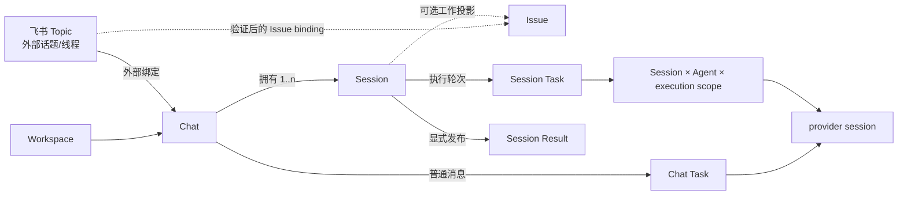

# Topic、Chat 与 Session

本页是 Remi 的权威产品约定。**Session 是核心领域对象，并且由 Chat 拥有；Issue 不是 Session 的必备父对象。**
`provider session` 必须带限定词，不能简称为 Session。


```mermaid
flowchart LR
  Topic["飞书 Topic<br/>外部话题/线程"] -->|外部绑定| Chat
  Workspace --> Chat
  Chat -->|拥有 1..n| Session
  Session -. "可选工作投影" .-> Issue
  Topic -. "验证后的 Issue binding" .-> Issue
  Session -->|执行轮次| SessionTask[Session Task]
  Session -->|显式发布| Result[Session Result]
  Chat -->|普通消息| ChatTask[Chat Task]
  SessionTask --> Lane["Session × Agent × execution scope"] --> Provider[provider session]
  ChatTask --> Provider
```

## 名词、身份与基数

| 名称 | 产品职责 | 持久化关系 |
|---|---|---|
| Topic | 飞书群原生话题/线程，是消息接入地址，不是 Remi 一级对象。 | 飞书 `chat_id` 与根消息 ID 组成外部键，经 binding 指向 Chat。 |
| Chat | 用户与一个 Agent 的持续对话及工作入口，保存消息、队列、未读状态和工作位置。 | 属于 Workspace，固定一个 Agent，拥有 1..n Session；普通 Web/私聊 Chat 不保存通用 Issue 外键。 |
| Session | 有稳定 ID、状态、参与者、追加事件、独立 Agent lane 和成果的持久工作脉络。 | 必须属于且只属于一个 Chat；默认 `Main` 在 Chat 创建时建立，同一 Chat 可再建多个 Session；可选关联 0..1 个同 Workspace Issue。 |
| Issue | 对部分工作进行跟踪、分派和验收的管理锚点。 | 通过 Session 或验证后的飞书 Issue Topic 聚合工作；Issue 不拥有 Session，删除 Issue 只清空关联投影。 |
| Task | 一次可调度、可取消、可审计的执行轮次。 | 普通 Chat Task 只有 Chat 上下文；Session Task 同时记录所属 Chat 与 Session，并可快照当时的 Issue。 |
| Session Result | Session 显式发布的不可变成果。 | 始终记录来源 Chat/Session，可选记录来源 Task；Issue 只在关联存在时提供聚合视图。 |
| provider session | Codex/Claude 等后端的上下文续接标识。 | Chat 保存普通对话续接状态；Session 按 lane 保存。它不是产品 Session。 |

数据库表 `multiremi_issue_sessions`、列 `issue_session_id` 和兼容类型 `MultiremiIssueSession` 是历史命名，
不表达所有权。新契约使用 `Session.chat_id`；`issue_id` 是该 Session 当前 Issue 工作关联的可空投影，
不是所属 Chat 的通用外键。
规范 API 位于 `/api/multiremi/chats/:chatId/sessions`，旧 `/api/issues/:issueId/sessions` 只提供受 Chat
访问控制约束的聚合兼容视图。

## 创建与生命周期

### Chat 与 Session

- 创建 Chat 时同步建立唯一默认 `Main` Session；额外 Session 从该 Chat 显式创建。创建 Issue 不再创建 Session。旧 Issue 派发入口在首次创建 Task 时，若没有显式 Chat/Session，则通过兼容层懒创建 Chat 所有的默认 Session，以保留委派返回与依赖恢复所需的 lane。
- Session 的标题、`active`/`archived`、摘要、参与者、事件和 lane 独立存在。切换 Session 或 Agent 会切换 lane。
- Session 归档会隐藏该工作脉络并禁止创建新的 Session Task，但不等于 Chat 归档。Chat 归档会取消该 Chat 下尚未完成的普通 Chat Task
  与 Session Task；恢复 Chat 后，未单独归档的 Session 可继续使用。
- 删除 Chat 是显式破坏性操作：其消息、Session 事件及成果随所有者删除；Task 审计行保留，但 Chat/Session
  外键清空。删除或解绑 Issue 不删除 Chat、Session、Task 或成果。

### 关联到 Issue

最新 main 已按 MUL-301 移除普通 Chat 的通用 `issue_id`。MUL-1 在该边界上定义 Session 的可选关联：

1. 普通 Chat 及其 Session 可在没有 Issue 时工作；创建 Issue 也不会自动创建 Session。
2. 从 Issue 入口创建工作时，创建的是“由某 Chat 拥有、同时关联该 Issue”的 Session。只有这些 Session
   出现在 Issue 的聚合视图；同一 Chat 中未关联的其他 Session 不会被隐式纳入。
3. 经服务端验证的飞书 Issue Topic binding 是例外的传输关联：建立 binding 时，可把该 Topic Chat
   当时未关联 Issue 的 Session 投影到目标 Issue。普通 Web Chat、飞书私聊及未验证群聊不能走这条路径。
4. 关联前创建的 Task 保留 `issue_id = null` 审计快照。关联后的 Session Task 同时记录
   `chat_session_id`、`issue_session_id` 和当时的 `issue_id`；历史 Task 不追溯重写。
5. 成果的所有权始终是 Chat/Session。Session 关联 Issue 后，其新成果进入 Issue 聚合视图；取消关联或
   删除 Issue 不删除原 Chat/Session/成果。Issue 聚合不得扩大私有 Chat 的访问权限。

关联只改变工作管理投影，不合并 transcript、队列或 provider context。普通 Chat 的 Project 选择仍与 Issue
独立，具体迁移约束见 [Chat–Issue 解耦迁移](migrations/chat-issue-decoupling.md)。

## Task、消息与成果边界

- 普通 Chat 消息继续创建/steer Chat Task；本次不把它自动路由进默认 Session。该交互演进属于 **MUL-3**。
- 普通 Chat 的 pending/queue/edit/prioritize/steer 入口只处理 Chat Task，不会选中或改写同一 Chat 下的 Session Task；
  Chat 归档/删除则会停止全部子 Task，以维持所有者生命周期边界。
- 飞书绑定 Issue 后既有的协调员 handoff 仍可显式创建或 steer 同 Chat、同 Issue 的 Session Task；这是受限的
  控制面兼容路径，不会把普通 Chat 输入、消息记录或队列自动并入 Session。
- 显式 Session Task 同时携带 Chat 与 Session 身份；Session 的 Issue 关联可空。归档的所属 Chat 不能再创建
  Session Task。
- Session message 是追加事件，不等同于 Issue 评论。只有 Session 当前关联 Issue 且调用兼容 Issue message
  入口时，才同时形成 Issue 评论。
- Task 输出或完整 transcript 不自动成为成果。只有显式 publish 才创建 Session Result；跨 Session 复用
  应使用成果，而不是读取来源 Session 的私有事件。

## 存量迁移与兼容

升级迁移先放宽旧 `issue_id NOT NULL`，增加 `chat_id` 并改变级联语义：

- 在 MUL-301 移除旧 Chat `issue_id` 前，若一个存量 Issue 恰好只绑定一个 Chat，旧 Session 及其
  Task/成果可无歧义地自动归到该 Chat。
- 若实例已经执行 MUL-301、旧 Chat `issue_id` 已删除，则只把唯一且经验证的飞书 Issue Topic binding
  当作自动归属证据；普通 Chat 不通过标题、历史 Task 或时间邻近关系推测 Issue。
- 每个尚无默认 Session 的存量 Chat 补建 `Main`；这不改变普通 Chat message → Task 行为。
- 一个 Issue 没有 Chat 或绑定多个 Chat 时，迁移不猜测所有者。旧 Session 暂以 `chat_id = null` 保留在
  兼容 Issue API；它可读、可导出。`remi session adopt` 可把它显式归入已有 Chat；若旧客户端从 deprecated
  Issue Session Task 入口发起一次明确执行，服务端则以所选 Agent 新建独立 Chat，再把该 Session（以及必要的
  未归属父 Session）安全归入新 Chat 后执行，不会猜测或复用某个既有 Chat。
- Chat-owned Session 迁移必须先于 Chat–Issue 解耦迁移执行；后者完成后普通 Chat 不再保留 `issue_id`。
- SQLite 迁移在单事务中重建两张元数据表，迁移后执行外键检查；PostgreSQL 放宽非空约束并重建索引/外键。
  任一步失败都不会记录迁移完成标记。
- 旧 Issue 嵌套 REST、`IssueSession` 类型和 `remi issue session ...` 兼容入口可继续读取；新代码、CLI 与 UI
  使用 Chat 路径和 `Session` 名称。没有数据需要伪造占位 Issue。

## 飞书行为

| 飞书入口 | 外部会话键 | 产品行为 |
|---|---|---|
| 个人 Bot 私聊 | 私聊 `chat_id` | 同一私聊持续映射同一 Chat；Chat 创建时有 `Main` Session，但普通输入仍创建/steer Chat Task。 |
| 群顶层消息 | `chat_id:thread:<message_id>` | 根消息开启 Topic 并映射独立 Chat。 |
| 群 Topic 回复 | `chat_id:thread:<root_id>` | 续接同一 Topic/Chat。 |

`/new` 取消活跃 Task 并解除外部 binding；下一条消息创建新 Chat，旧 Chat 不自动删除。`/chat` 查看当前 Chat；
旧 `/sessions` 只是 Chat 查询别名，不列产品 Session。Daemon `_topics/<topic-id>` 是 Issue 建立前的临时目录，
`remi issue bind-topic` 是恢复入口，二者都不是产品 Topic 容器。

## 术语与范围

- 产品文案统一使用 **Chat**、**Session**、**Issue**、**Task** 和 **Session Result**。
- 不使用 “Chat Session” 或 “Issue Session” 作为产品名；需要限定时写“某 Chat 的 Session”或
  “当前关联到某 Issue 的 Session”。
- 本次不实施 **MUL-2** 的单用户 Workspace 重构，也不实施 **MUL-3** 的普通 Chat 消息到 Session Task
  路由；这里只固定它们将来必须遵守的所有权与接口边界。

## 验证入口

```bash
bun test tests/unit/multiremi/multiremi-issue-sessions.test.ts
bun test tests/unit/multiremi/multiremi-store-chat.test.ts
bun test tests/unit/multiremi/multiremi-feishu-bot-task-bridge.test.ts
npm run docs:test
npm run docs:check
```

监督者的 Issue 任务恢复操作沿用工作区 organizer 的授权、模式和审计检查；Session Task 同时关联 Chat 不会被误判为普通 Chat Task。普通 Chat 的 redispatch 仍受创建者与任务凭据隔离限制，侧 Session 不能发起监督者 redispatch。
