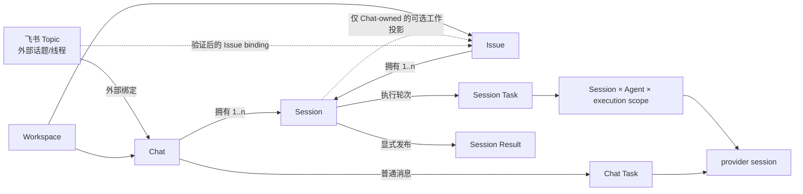

# Topic、Chat 与 Session

本页是 Remi 的权威产品约定。**每个 Session 恰好由一个 Chat 或一个 Issue 拥有。**
Chat-owned Session 可以关联一个 Issue；这个工作投影不改变 Session 的所有者。
`provider session` 必须带限定词，不能简称为 Session。


```mermaid
flowchart LR
  Topic["飞书 Topic<br/>外部话题/线程"] -->|外部绑定| Chat
  Workspace --> Chat
  Workspace --> Issue
  Chat -->|拥有 1..n| Session
  Issue -->|拥有 1..n| Session
  Session -. "仅 Chat-owned 的可选工作投影" .-> Issue
  Topic -. "验证后的 Issue binding" .-> Issue
  Session -->|执行轮次| SessionTask[Session Task]
  Session -->|显式发布| Result[Session Result]
  Chat -->|普通消息| ChatTask[Chat Task]
  SessionTask --> Lane["Session × Agent × execution scope"] --> Provider[provider session]
  ChatTask --> Provider
```

## 名词、身份与基数

| 名称 | 产品职责 | 持久化关系 |
|---|---|---|
| Topic | 飞书群原生话题/线程，是消息接入地址，不是 Remi 一级对象。 | 飞书 `chat_id` 与根消息 ID 组成外部键，经 binding 指向 Chat。 |
| Chat | 用户与一个 Agent 的持续对话及工作入口，保存消息、队列、未读状态和工作位置。 | 属于 Workspace，固定一个 Agent，拥有 1..n Session；普通 Web/私聊 Chat 不保存通用 Issue 外键。 |
| Session | 有稳定 ID、状态、参与者、追加事件、独立 Agent lane 和成果的持久工作脉络。 | 恰好由一个 Chat 或 Issue 拥有；每个所有者创建时建立自己的默认 `Main`，可再建多个 Session。Chat-owned Session 可选关联 0..1 个同 Workspace Issue。 |
| Issue | 对工作进行跟踪、分派和验收的管理实体。 | 拥有自己的 Sessions，也可聚合关联到它且调用者有权访问的 Chat-owned Sessions。 |
| Task | 一次可调度、可取消、可审计的执行轮次。 | 普通 Chat Task 只有 Chat 上下文；Session Task 记录 Session 及当时的 owner 上下文。Issue-owned Task 的 `chat_session_id` 为空。 |
| Session Result | Session 显式发布的不可变成果。 | 记录来源 Session，可选记录来源 Task；Chat-owned 来源记录 Chat，Issue-owned 来源记录 Issue。Issue 聚合遵循来源 Session 的访问权限。 |
| provider session | Codex/Claude 等后端的上下文续接标识。 | Chat 保存普通对话续接状态；Session 按 lane 保存。它不是产品 Session。 |

数据库表 `multiremi_issue_sessions`、列 `issue_session_id` 和兼容类型 `MultiremiIssueSession` 是历史命名，
不单独表达所有权。所有者由现有字段确定：

| 持久化字段 | 所有者 | `issue_id` 的含义 |
|---|---|---|
| `chat_id` 非空 | 该 Chat | 可空的 Issue 工作投影 |
| `chat_id` 为空、`issue_id` 非空 | 该 Issue | Issue 所有者 |

`chat_id` 与 `issue_id` 不能同时为空。Domain 类型显式提供 `ownerType`、`ownerId`；REST wire 对应
`owner_type`、`owner_id`，调用方不能把 Chat-owned 的非空 `issue_id` 解释成第二个所有者。

Chat 路径 `/api/multiremi/chats/:chatId/sessions` 管理该 Chat 的 Sessions。
Issue 路径 `/api/issues/:issueId/sessions` 创建 Issue-owned Session，并列出 Issue-owned 与有权访问的
Chat-owned 工作投影。该聚合按 Chat 创建者和 Agent 可见性过滤私有投影，再批量读取参与者；工作区管理员
也不能借 Issue 读取他人的私有 Chat。通用 `/api/sessions/:sessionId`、日志与继承诊断按实际 owner 鉴权，
Task 凭据通常只读取自身绑定的 Session、控制自身 Task；继承与已验证飞书 Topic 协调有下述受限例外。

## 统一日志兼容

普通 Chat 消息和工作 Session 事件使用各自稳定 ID 写入统一 conversation log。两种所有权的 Session 都建立日志头并参与升级回填与对账；没有 Issue 的 Chat-owned Session 同样保存执行终态。Issue 公开评论仍可保留空 `issue_session_id`；内部日志使用该 Issue 自己的 `Main`，不把 Chat-owned 工作投影当作默认会话。编辑、删除和解决状态根据实际日志行定位。该日志关联不改变评论的公开范围，也不扩大私有 Chat 的访问权限。

升级时的一次性日志迁移补齐旧 Issue 评论及非 Chat 任务缺失的 Session 关联；普通 Chat 任务继续保留自己的上下文。任务调度和终止后的待办重试以 `issue_session_id` 区分 Session 任务，不能仅凭存在 `chat_session_id` 把它当作普通 Chat 消息轮次。

## 创建与生命周期

### 所有者与 Session

- 创建 Chat 或 Issue 时，在同一事务中建立该所有者唯一默认的 `Main` Session；额外 Session 从对应所有者显式创建。Issue 派发使用 Issue-owned Session，不需要创建 Chat 或隐式转移所有权。
- 旁聊的父 Session 必须属于同一 owner、同一 Workspace。继承既有 Chat-owned 工作投影时，旁聊仍由该 Chat 拥有，不能借 Issue 入口变成公开的 Issue-owned Session。
- Session 的标题、`active`/`archived`、摘要、参与者、事件和 lane 独立存在。切换 Session 或 Agent 会切换 lane。
- Session 归档会隐藏该工作脉络并禁止创建新的 Session Task，但不等于所有者归档。Chat 归档会取消该 Chat 下尚未完成的普通 Chat Task
  与 Session Task；恢复 Chat 后，未单独归档的 Session 可继续使用。
- 删除 Chat 时删除它拥有的 Sessions、事件、参与者、lane、成果及统一日志与日志头；Task 审计行保留，清空失效的 Session 引用，并保留原 Chat 身份作为私聊权限标识，避免删除后暴露历史 transcript。
- 删除 Issue 时删除它拥有的 Sessions 及上述附属数据，并保留 Task 审计。对 Chat-owned Session 只清空该 Issue 的工作投影，不删除 Chat、Session 或成果。解绑工作投影也不删除 Chat-owned Session。

### 关联到 Issue

普通 Chat 没有通用 `issue_id`；Chat-owned Session 可建立 Issue 工作投影：

1. 普通 Chat 及其 Session 可在没有 Issue 时工作。Issue 有独立的 Main 和额外 Sessions，不依赖 Chat。
2. Issue 聚合视图包含该 Issue 自己的 Sessions 和可见的 Chat-owned 工作投影；同一 Chat 中未关联的其他
   Sessions 不会被隐式纳入。从 Issue 新建普通工作 Session 时，所有者就是该 Issue。
3. 经服务端验证的飞书 Issue Topic binding 是例外的传输关联：建立 binding 时，可把该 Topic Chat
   当时未关联 Issue 的 Session 投影到目标 Issue。普通 Web Chat、飞书私聊及未验证群聊不能走这条路径。
4. Chat-owned Session 关联前创建的 Task 保留 `issue_id = null` 审计快照。关联后的 Session Task 同时记录
   `chat_session_id`、`issue_session_id` 和当时的 `issue_id`；历史 Task 不追溯重写。
5. Chat-owned Session 的新成果在有 Issue 工作投影时进入对应聚合视图；取消投影或删除 Issue 不删除原
   Chat/Session/成果。Issue 聚合、公开分享与执行上下文均不得扩大私有 Chat 的访问权限。

关联只改变工作管理投影，不合并 transcript、队列或 provider context。普通 Chat 的 Project 选择仍与 Issue
独立，具体迁移约束见 [Chat–Issue 解耦迁移](migrations/chat-issue-decoupling.md)。

## Task、消息与成果边界

- 普通 Chat 消息继续创建/steer Chat Task；本次不把它自动路由进默认 Session。该交互演进属于 **MUL-3**。
- 普通 Chat 的 pending/queue/edit/prioritize/steer 入口只处理 Chat Task，不会选中或改写同一 Chat 下的 Session Task；
  Chat 归档/删除则会停止全部子 Task，以维持所有者生命周期边界。
- Session Task 凭据不包含所有者 Chat 的普通对话权限：不能借 `chat_session_id` 或创建者身份读写普通消息、Chat root log 或队列。普通 Chat 轴须由真实执行分类及持久化用户消息证明来源；重试仅沿服务端保存的 attempt 血统继承该证据，Topic transport 须有已验证 binding，不能只信调用方的 `kind`。合法普通 Chat/Topic Task 继续沿用既有创建者、工作区与 Agent 权限规则。
- 没有 Issue 工作投影的 Chat-owned Session Task 与同 Chat 的普通 Task 共用 Chat checkout，领取时跨 Agent 串行预约该目录；两类消息队列仍独立。未知 offer 尚有 `offered_at` 时保留预约，确认 rejected 后释放；已预约的普通 Chat offer 可以重新领取并重发，不被后来排入的高优先级消息阻挡。Runtime 工作区沿用自己的目录预约，Issue-owned 或带 Issue 工作投影的执行目录另按对应规则处理。
- 飞书绑定 Issue 后既有的协调员 handoff 仍可显式创建或 steer 同 Chat、同 Issue 的 Session Task；这是受限的
  控制面兼容路径，不会把普通 Chat 输入、消息记录或队列自动并入 Session。
- 显式 Session Task 始终携带 Session 身份。Chat-owned Task 还携带 Chat 身份，Issue 工作投影可空；
  Issue-owned Task 携带 Issue 身份，`chat_session_id = null` 是正常状态。创建检查 Session、实际 owner、
  Workspace 和归档状态，不以造 Chat 或 adopt 作为执行前置步骤。
  daemon 协议按执行来源保留 `direct`、`comment`、`autopilot` 等分类；仅普通 Chat Task 使用 `kind=chat`。
- 已归档 Session 拒绝普通新建 Task。既有 `delegation_return` 或 turn-end `re_ring` 可通过内部收尾路径继续，但服务端须在锁内核对真实 source、父 Task、return Session、Workspace、Agent 与执行 scope。该授权是内部参数，不属于公开 `CreateTaskInput` 或 API 字段；调用方填写 system 作者、wake source 或 delegation 字段不能绕过归档检查。
- Session message 是追加事件，不等同于 Issue 评论。只有 Session 当前属于或关联该 Issue 且调用 Issue message
  入口时，才同时形成 Issue 评论。
- Task 凭据在同工作区跨 Issue 评论时保留来源 Task 作为作者审计，但不自动带入来源 Session；显式指定的
  Session 仍须当前关联目标 Issue，避免把另一个 Issue 的私有会话接到评论中。
- 旁聊 Task 可通过 `/log/entry?from=X&to=Y` 读取同 owner、同 Workspace 的直接父 Session，范围不得超过当前 Task 已持久化的继承截止 seq，且必须已有继承领取记录。这个例外只开放范围读取，不开放父 Session metadata、任意日志窗口或尾部；范围响应清空可能携带后续可变结果的 entry metadata，也不推进父会话已读游标。
- 经服务端验证 binding 的飞书群 Issue Topic 普通 Chat Task 可协调绑定 Issue 的 Session：读取 Session metadata、列出或创建 Session Task，并读取交接 Task 的安全 metadata 或追加 steer。Chat-owned 目标须属于同一 Topic Chat，Issue-owned 目标须属于绑定 Issue；协调响应不含 prompt、result、error 或 progress 正文。Topic 协调任务还可向绑定 Issue-owned Session 主动 POST message，沿用公开 Issue 评论写入；Chat-owned 工作投影的 message 写入仍受本 Session 限制。该例外不开放其他 Session 的 events、logs、trace、messages 读取，也不允许取消或 inspection 其他 Task。监督者 organizer redispatch 仍须通过既有身份、授权及审计检查。
- 通用任务派发允许按实际 Issue owner 与 Workspace 权限向同工作区的其他 Issue-owned Session 创建委派任务，仍须通过既有 delegation、父 Task 血统、交接及旁聊派发检查；创建成功不授予来源 Task 凭据读取或控制新 Task 的权限。Chat-owned 目标继续遵循私有 Session 或已验证 Topic 协调边界。
- Issue 触发的 Autopilot 使用 Issue-owned Session，不创建或隐式 adopt Chat；`reuse_latest` 只复用同 Issue 的 active Issue-owned Session，不选择 Chat-owned 工作投影。
- Task 输出或完整 transcript 不自动成为成果。只有显式 publish 才创建 Session Result；跨 Session 复用
  应使用成果，而不是读取来源 Session 的私有事件。
- daemon 注入的 provider 历史按 Session owner 过滤：Issue-owned 只使用同一 Issue 拥有的 Sessions，Chat-owned 只使用同一 Chat 拥有的 Sessions。Issue 的归档或删除不收集或清理 Chat-owned 工作投影的 provider home。
- provider 目录归属以 `gc.json` 中明确的 `chat_session_id` 为准：`null` 表示 Issue-owned，Chat ID 表示该 Chat。旧早期 trace 目录缺少这个字段时保留数据，不注入 prompt，也不纳入 Issue archive/GC；它与数据库 Session 的已知 owner 迁移是不同边界。

## 存量迁移与兼容

升级保留现有 Session ID、所有者和工作记录：

- 已有非空 `chat_id` 的 Session 保持 Chat-owned；`chat_id = null` 且 `issue_id` 非空的 Session 是完整可执行的 Issue-owned Session。旧 Chat 外键或飞书 binding 不作为自动换 owner 的依据。
- 为没有默认会话的 Chat 和 Issue 补建各自的 `Main`；Issue 默认查询只接受 Issue-owned Session，不从 Chat-owned 工作投影中挑选。
- `20261008_dual_owned_sessions` 在事务中核验 owner 存在、父子同 owner 以及 Main 唯一性，再建立所有者非空约束与两类 Main 的部分唯一索引。旧 Issue 移动遗留的 Issue-owned Session 工作区跟随已知 Issue owner 修正；Chat-owned 的跨工作区或失效 Issue 工作投影及其成果投影解除，Chat owner 保持不变。
- 历史 Session 若同时缺少 Chat 和 Issue，迁移明确报错并回滚，不删除数据、不猜归属、不记录该迁移完成标记；错误数据须先按实际所有者核实处理。无法确定的 owner、Chat owner 工作区冲突、父子归属或默认会话冲突同样阻止迁移；上述有确定 owner 的旧移动修复也随失败回滚。
- SQLite 重建 Session 表并在提交前检查外键；PostgreSQL 添加约束。失败不记录双所有权迁移完成标记。
- `remi session adopt <chat> <session>` 是用户显式把 Issue-owned Session 转入 Chat 的操作；有未完成 Task、父 Session 或子 Session 时拒绝。执行入口不会自动 adopt。
- `IssueSession` 类型保留为兼容别名。Chat 与 Issue 的嵌套 REST、CLI 都是一等入口；无归属依赖需要通过伪造占位 Issue 或 Chat 解决。

## Web 与 CLI 入口

- Issue 会话列表提供新建与旁聊；没有可见 Session 的空态也提供创建入口。创建成功后选择返回的 Session。
- Chat 顶部的「工作 Sessions」打开该 Chat 的工作会话管理：列表、新建、旁聊、显式派发 Task、日志和执行过程。普通 Chat 输入、消息历史与队列仍使用 Chat Task。
- `remi session create|list <chat>` 和其 `<chat> <session>` 子命令管理 Chat-owned Sessions。
- `remi issue session create|list <issue>` 和其 `<issue> <session>` 子命令管理 Issue-owned Sessions；Issue 列表及成果列表也保留可见工作投影的聚合。
- `remi session show <session>`、`remi session log ... <session>`、`remi session inherited-context <session>` 按 Session ID 访问两种所有者。参数与成果发布方式见 [CLI 命令契约](cli-command-migration.md)。

## 飞书行为

| 飞书入口 | 外部会话键 | 产品行为 |
|---|---|---|
| 个人 Bot 私聊 | 私聊 `chat_id` | 同一私聊持续映射同一 Chat；Chat 创建时有 `Main` Session，但普通输入仍创建/steer Chat Task。 |
| 群顶层消息 | `chat_id:thread:<message_id>` | 根消息开启 Topic 并映射独立 Chat。 |
| 群 Topic 回复 | `chat_id:thread:<root_id>` | 续接同一 Topic/Chat。 |

`/new` 取消活跃 Task 并解除外部 binding；下一条消息创建新 Chat，旧 Chat 不自动删除。`/chat` 查看当前 Chat；
旧 `/sessions` 只是 Chat 查询别名，不列产品 Session。Daemon `_topics/<topic-id>` 是 Issue 建立前的临时目录，
`remi issue bind-topic` 是恢复入口，二者都不是产品 Topic 容器。

## 术语与范围

- 产品文案统一使用 **Chat**、**Session**、**Issue**、**Task** 和 **Session Result**。
- 不使用 “Chat Session” 或 “Issue Session” 作为产品名；需要限定时写“某 Chat 的 Session”、
  “某 Issue 的 Session”或“关联到某 Issue 的 Chat-owned Session”。
- 本次不实施 **MUL-2** 的单用户 Workspace 重构，也不实施 **MUL-3** 的普通 Chat 消息到 Session Task
  路由；这里只固定它们将来必须遵守的所有权与接口边界。

## 验证入口

```bash
bun run scripts/run-tests.ts tests/unit/multiremi/multiremi-issue-sessions.test.ts tests/unit/multiremi/store-issue-sessions-repo.test.ts tests/unit/multiremi/store-migrations.test.ts
bun run scripts/run-tests.ts tests/unit/multiremi/chat-issue-privacy.test.ts tests/unit/multiremi/chat-session-log-access.test.ts tests/unit/multiremi/multiremi-side-session-api.test.ts
bun run scripts/run-tests.ts tests/unit/multiremi/multiremi-store-chat.test.ts tests/unit/multiremi/multiremi-feishu-bot-task-bridge.test.ts
npm run docs:test
npm run docs:check
```

以上是验证入口，本文不把列出命令当作已执行证明；Bun 版本及 PostgreSQL、浏览器验收前提见 [TESTING.md](../TESTING.md)。监督者的 Issue 任务恢复操作沿用工作区 organizer 的授权、模式和审计检查；Chat-owned Session Task 不会被误判为普通 Chat Task。普通 Chat 的 redispatch 仍受创建者与任务凭据隔离限制，侧 Session 不能发起监督者 redispatch。
