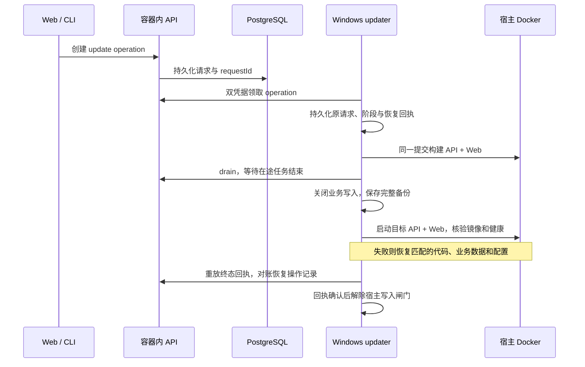

# 本机双环境

使用 [本机管理脚本](../../scripts/local-profile.mjs)和 [Compose 模板](../../deploy/docker/compose.local.yml)。需要 Node.js 22+、Git、tar 与运行中的 Docker Desktop（Linux 容器）；Windows 固定使用 `desktop-linux` context。Bun 1.3.14 和 Linux 依赖在镜像内安装，不要求宿主安装 Bun，也不使用宿主 Windows 的 node_modules。

| 内容 | stable | dev |
|---|---|---|
| 浏览器入口 | LAN 模式：`http://<内网IP>:13000`；默认 `http://127.0.0.1:13000` | `http://localhost:14000` |
| API / daemon 入口 | LAN 模式：`http://<内网IP>:16120`；默认 `http://127.0.0.1:16120` | `http://localhost:16220`，仅本机 |
| Compose 项目 | `remi-stable` | `remi-dev` |
| 配置及备份目录 | `~/.remi/profiles/stable/` | `~/.remi/profiles/dev/` |
| 源码 | `releases/<完整提交>/` 的 Git 快照 | 当前开发仓库 |
| Web | 固定提交的生产构建 | Next dev，配合 Compose watch |
| API | 固定镜像 | Bun watch，配合 Compose watch |
| PostgreSQL / 文件卷 | `remi-stable_postgres-data` / `remi-stable_api-home` | `remi-dev_postgres-data` / `remi-dev_api-home` |
| 自动任务与轮询 | 默认开启 | 默认关闭 |

这里的 `~` 是当前用户目录。Windows 示例：`C:\Users\sentuix\.remi\profiles\stable`。配置、源码快照和备份在该目录；数据库与运行文件保存在 Docker 管理的上述独立 Linux 卷中，不是仓库内的普通目录。

目录隔离不能代替数据和登录隔离。两个 API 的数据库、token、JWT secret、home、uploads 和 session archives 独立；PostgreSQL 不发布宿主端口。浏览器使用不同 hostname，因为现有 Cookie 不按端口隔离。保持表中入口，不要将两边都改成 localhost。每套网络中的 `api` 和 `postgres` 只指向该套环境。

WebSocket 通过 `NEXT_PUBLIC_WS_URL` 直连所选环境的 API 端口，LAN 模式使用内网 IP，默认使用 loopback，避免 Next dev 的 `/ws` 代理握手阻塞；普通 HTTP API 仍走 Web 的同源代理。`MULTIREMI_DAEMON_DIRECT_BASE_URL` 使用同一个 API origin，供 daemon 连接及归档直接上传；`/api/config` 的 `daemon_server_url` 和 CLI 安装说明一起返回它，所以即使从本机页面打开安装弹窗，也不会给远程机器生成 localhost 地址。默认发行构建保留原来的 WebSocket URL 推导行为。

两套 API 都保持生产鉴权检查，dev 的开发模式只用于源码重载和 Web 编译。默认使用 SQL 项目知识库，不运行 OpenViking 或 SSH Mesh 控制面。dev 不运行 platform-updater；stable 只有按下文安装仓库外宿主后才运行 updater。两套环境不能共用 updater 状态、飞书/SCM 凭据或 profile 数据。

## 启动和开发

从仓库根目录运行：

```powershell
node scripts/local-profile.mjs stable deploy --ref HEAD
node scripts/local-profile.mjs dev deploy
node scripts/local-profile.mjs dev watch
```

stable 只打包已提交的 Git 内容；未提交修改不会进入快照。`--ref` 可以指定已检查的 commit。dev 读取当前工作树；watch 运行期间同步源码并在依赖清单改变时重建，忽略 node_modules、`.next`、Git 元数据和环境文件。Compose 2.30 不支持首次自动全量同步，因此每次启动 watch 都先构建；关闭 watch 终端只停止同步，不停止容器。

## stable 内网访问

在主机选择实际的 RFC 1918 内网 IPv4 地址，然后部署；下面的 IP 仅为示例，需要替换：

```powershell
node scripts/local-profile.mjs stable deploy --ref HEAD --lan-host 192.168.40.12
```

该选项把 stable 的 Web `13000` 和 API `16120` 宿主端口一起绑定到 `0.0.0.0`，但浏览器和 daemon 使用实际内网 IP，不能用 `0.0.0.0` 连接。PostgreSQL 仍不发布端口。dev 不接受该选项，始终绑定 loopback。监听地址和对外地址保存在 profile 的 `deployment.json` / `active.json`，后续省略 `--lan-host` 的 stable 升级保留配置；IP 改变时以新地址重新部署，同时重建内嵌 WebSocket 和登录地址的 Web 镜像。构建失败会恢复原配置，未切换运行中的服务。

Windows 防火墙需要允许内网客户端访问这两个端口；只在需要时由管理员创建私有网络规则，例如：

```powershell
New-NetFirewallRule -Name Remi-Stable-LAN -DisplayName 'Remi stable LAN' -Direction Inbound -Action Allow -Protocol TCP -LocalPort 13000,16120 -Profile Private -RemoteAddress LocalSubnet
```

从另一台内网机器验证 Web `/login` 和 API `/readyz`，再检查登录、安装命令和 WebSocket 鉴权。仅在服务主机上访问内网 IP 不能证明防火墙已放行远端连接。`--lan-host` 不修改路由器、公网转发或防火墙，也不自动更改其他服务规则。

Docker Desktop 运行时，容器按 `unless-stopped` 自动恢复；主机重启后是否自动启动 Docker Desktop 取决于其本机设置。`dev` 不复制 stable 数据或身份凭据，默认关闭调度器；需要测试自动任务时，显式调整该环境的配置并重新启动。

## 本机登录

本机镜像明确设置 `NEXT_PUBLIC_LOCAL_PROFILE=stable/dev`，在 `127.0.0.1` 或 `localhost` 页面增加账号密码和“本机会话密钥（24 小时）”登录入口。stable 还在 `NEXT_PUBLIC_SITE_URL` 配置的内网主机名显示账密入口，本机会话密钥入口仍只在 loopback 页面显示；API 始终独立验证凭据。飞书入口保留，默认发行构建和未配置的主机名保持原来的登录页面。

本机 Compose 启用 `MULTIREMI_ALLOW_PASSWORD_LOGIN=1`，其他部署默认关闭密码登录；同时关闭会在响应中返回验证码的旧邮箱/Google 测试 fallback，避免它绕过密码校验。账号需要部署管理员预先配置，没有公开注册入口。密码使用 Argon2id 加盐哈希，保存在该环境的私有数据库表中，源码、镜像及 `api.env` 都不包含账号密码。支持普通邮箱和 `user@localhost` 形式的本机账号。

管理员通过 `remi context auth password-account set --file -` 从标准输入读取 JSON（`email`、`password`、可选 `name` 和 `workspaceId`），使用对应部署的主令牌配置账号；默认工作区为 `local`。此操作会把账号加入指定工作区并赋予 owner，更新已有账号密码时撤销其浏览器会话。普通用户、任务令牌、daemon 和本机会话 JWT 都不能调用此管理接口。避免把 JSON 或密码直接写进 shell 历史；可从本机密码输入提示构造标准输入。

配置后可以在页面直接使用账号密码，也可以通过 `remi context auth password --file -` 登录 CLI。登录签发绑定真实用户的 30 天会话，同时支持 HttpOnly Cookie；它只具有该用户已加入工作区的权限。Web 退出登录会删除 Cookie 并撤销该浏览器会话。两套环境须分别配置，账号及会话不会自动同步。

在自己的终端获取对应环境的密钥，然后粘贴到该环境登录页面：

```powershell
node scripts/local-profile.mjs stable token
node scripts/local-profile.mjs dev token
```

命令使用该 profile 外部 `api.env` 中的 `JWT_SECRET`，离线签发有效期 24 小时、身份为 `local` 的会话 JWT；不会输出永久主令牌或签名密钥。它沿用本机 `local` 用户的既有权限，工作区列表按该用户的成员关系过滤。登录时 `/api/me` 设置 HttpOnly Cookie，供附件预览和原生下载使用；到期后重新运行命令并登录。会话密钥不要放进 Git、URL 或截图。复制整个 stable 配置目录给 dev 会连带复制身份与加密密钥，应让脚本为 dev 单独初始化。

## 日常操作与升级

```powershell
node scripts/local-profile.mjs stable status
node scripts/local-profile.mjs dev status
node scripts/local-profile.mjs stable logs
node scripts/local-profile.mjs dev stop
node scripts/local-profile.mjs dev up
node scripts/local-profile.mjs stable backup
```

开发流程：在分支修改 → dev 验证 → 运行对应测试和文档检查 → 提交 → 使用具体 commit 更新 stable。stable 的源码和镜像不会跟随开发目录或分支切换自动变化。部署本机提交不等于创建 GitHub Release；正式发版仍遵循 [仓库规则](../../AGENTS.md)。

`deploy` 更新已激活的环境时先构建候选镜像，再停止该环境的 API/Web 写入，保存数据库逻辑备份、API home、旧配置与镜像记录，然后启动并等待健康检查；已经 stop 的环境也保留升级备份步骤。单独 `backup` 同样停止写入，成功后只恢复原本运行的 API/Web。新备份的 `complete.json` 包含每个恢复文件的大小和 SHA-256；旧版只有时间戳的 marker 不满足自动恢复校验。中途失败的目录不能当作可恢复备份。稳定环境升级前还应结束正在执行的 Agent 任务；API 启动会自动迁移数据库，关闭后台任务也不会跳过迁移。

备份保存在 profile 的 `backups/<时间>/`。停止、重建和升级命令保留命名卷；脚本不提供删除卷操作。回滚涉及数据库模式时，先停止该环境 API/Web，恢复匹配备份的 PostgreSQL 和 API home，再使用备份配置启动旧镜像；只切旧代码不能保证与已迁移数据兼容。备份和旧镜像都应保留到升级后的实际使用验证完成。

## 可恢复的 stable 自更新宿主

普通 `stable deploy` 是人工前台流程；终端或执行它的 Agent 退出后不会被另一个进程接管。生产自更新使用[平台部署说明中的 Windows 宿主](../../deploy/README.md#windows-stable-local-profile-host)，不要把 `deploy` 包进当前 Remi Task。

更新范围是同一固定提交的 **API 与 Web 两个容器**。浏览器或 CLI 向容器内 API 创建 operation；宿主 updater 经发布到宿主的 API 端口轮询领取，再调用宿主 Docker Compose。容器无需 Docker socket，也不需要 SSH 到 Windows；专用 updater 凭据只保存在宿主与 API 配置中。



宿主沿用 platform operation API/CLI：

```powershell
remi platform operation create --file update.json --yes --json
remi platform operation list --json
remi platform operation cancel <operation-id> --yes --json
```

`update.json` 使用发布 manifest URL 和可重试 request ID，例如：

```json
{
  "kind": "update",
  "requestId": "MUL-17-prod-2026-09-27-01",
  "targetVersion": "0.2.81",
  "targetRef": "https://github.com/OWNER/REPO/releases/download/v0.2.81/platform-release.json"
}
```

回滚同样走 `platform operation create`，kind 为 `rollback`，并用 `targetRef` 指向备份中 `active.json` 的完整 commit。宿主只选择带 v2 hash manifest、同时包含 PostgreSQL dump、API-home archive 和匹配配置的完整备份。取消只在 `queued/preparing/pulling/draining` 安全阶段生效；进入切换后由宿主完成或回滚，不能强行中止。

宿主启动时先执行本地恢复，再重放终态回执，然后才发送心跳和领取新操作。阶段位于 `host-operations/<operation-id>/operation.json`，原始 API 请求及终态回执位于 `host-operation-receipts/`，两者均在容器与业务数据库之外。回执经 updater 专用 `operations/reconcile` 接口幂等补回数据库恢复丢失的操作；成功上报后仍保留，后续回滚可能再次还原旧操作状态。对账冲突或恢复未完成时不领取新操作、不开放业务写入；日志和回执不保存 token、完整环境或 profile 密钥。

切换期间维护租约不会按普通 drain TTL 自动开放。宿主还将固定的 Bun preload 写入闸门挂入 API，使用独立 `host-control/write-fence.json`，因此回滚到没有新中间件的旧 API 也能阻止业务写入。切换时业务 mutation 返回 `503 platform_update_in_progress` 和 `Retry-After: 5`；读取、健康检查及已有双凭据保护的 updater 通道仍可用。API/Web 的实际镜像 ID 与 Docker 健康状态都必须匹配目标，单独 `/readyz`、`/login` 返回 200 不算切换成功。只有匹配 operation 的终态回执获 API 确认后，宿主 `host-finalize` 才移除外部闸门。

数据库恢复会在 API/Web 停止后重建空数据库，以事务方式还原，避免新版新增表残留。显式回滚先给当前版本建立救援备份，再恢复目标业务快照；当前 operation、维护闸门和平台状态通过独立 `control-plane.dump` 保留，不随旧业务数据倒退。目标回滚失败时尝试恢复刚才的救援备份；仍失败则保持 `recovery_required` 和写入关闭，由下一次宿主启动继续恢复。备份缺文件、哈希不匹配或旧镜像丢失都会在替换数据前拒绝。回滚会恢复到所选备份时间的业务数据，不能保留该备份之后的业务变更。

`updaterStatus: offline` 且 `currentRelease/latestRelease` 为空的直接原因不是 Git 缓存或旧 daemon：local profile 默认没有启动 platform-updater，也没有配置独立 updater token 和 release feed，因而 `/api/platform-updater/heartbeat` 从未写入这些字段。`services: []` 同理只表示没有宿主 inspection 心跳，不表示 Docker 中没有服务。安装后必须同时核对 scheduled task 存活、token、feed URL、driver 和首次 heartbeat；只有 release feed 成功才会出现 `latestRelease`。

发布源尚未发布清单或临时不可用时，宿主记录错误并按五分钟间隔重试，仍执行本地恢复、心跳和操作领取。首次成功读取发布源前 `latestRelease` 为空；显式 `check_updates` 仍会报告读取失败。

宿主的 `host-control/updater-auth.env` 独立保留当前 API/updater 控制凭据，Compose 在历史 `api.env` 之后加载它，避免旧备份删除或覆盖更新器凭据而卡住结果确认。同一 operation 的恢复重试复用这些凭据；新的 operation 读取有效的配置组合。需要轮换控制凭据时，先更新宿主配置和 profile 的 `api.env`，再运行 `node scripts/local-profile.mjs stable host-auth-refresh` 并重建 API、重启 updater；写入闸门尚未解除时禁止轮换。不要输出或提交这些文件。

本机 Web 构建默认使用两个 Next.js worker，可通过 Compose 插值变量 `REMI_NEXT_BUILD_CPUS` 调整，以控制 Docker Desktop 的构建内存。恢复故障测试入口是 `node --test scripts/local-profile.test.mjs`；在已预载 `pgvector/pgvector:pg17` 与 `oven/bun:1.3.14` 的 Docker 主机上，设置 `MULTIREMI_TEST_DOCKER_RECOVERY=1` 并运行 `bun test tests/integration/platform-recovery-postgres.test.ts`，会在独立临时容器中验证数据库恢复与控制面重放，不访问实际 profile 数据库。

## 验证范围

`status` 检查 API `/readyz` 和 Web `/login`，只能证明服务启动。还应验证登录、旧工作区与 Issue 数量、浏览器 API/WS，以及 dev token 无法访问 stable。Agent 执行还需要给对应环境单独注册 Runtime；宿主 Codex 已登录不等于平台已有可用 Runtime。真实 provider、飞书、SSH Mesh 与外部同步各自需要对应验证。

配置隔离测试：`bun test tests/arch/deploy-local-profiles.test.ts`。实际部署版本、迁移备份和本次测试结果记录在任务中，本页只维护操作方法。
