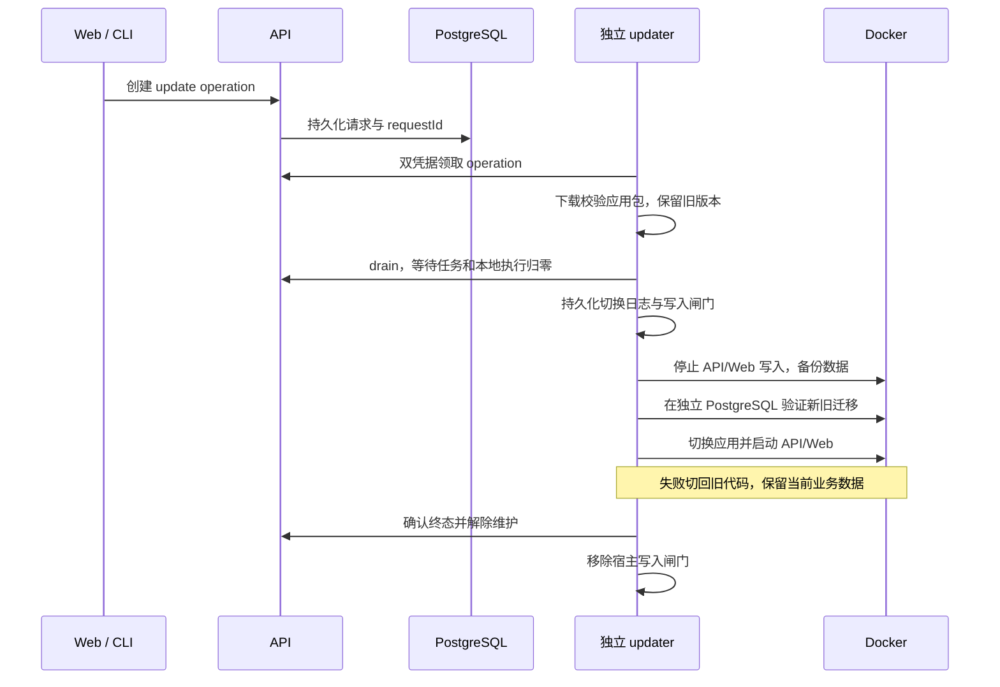

# 本机双环境

首次部署使用 [本机管理脚本](../../scripts/local-profile.mjs)和 [Compose 模板](../../deploy/docker/compose.local.yml)，需要 Node.js 22+、Git、tar 与运行中的 Docker Desktop（Linux 容器）；Windows 固定使用 `desktop-linux` context。stable 首次部署默认下载 CI 镜像，还需已登录的 GitHub CLI（`gh auth login`）读取当前 origin 仓库的 Actions 产物；私有 GHCR 镜像需预先 `docker login ghcr.io`，使用有 read:packages 权限的凭据。Bun 1.3.14 和 Linux 依赖在 CI 镜像内安装，不使用宿主 Windows 的 node_modules。接入下文内部更新模式后，日常升级由 Compose 中独立 updater 下载应用及 Bun/Node，不再要求宿主 Git、Node、Bun 或 Docker CLI 参与更新。

| 内容 | stable | dev |
|---|---|---|
| 浏览器入口 | LAN 模式：`http://<内网IP>:13000`；默认 `http://127.0.0.1:13000` | `http://localhost:14000` |
| API / daemon 入口 | LAN 模式：`http://<内网IP>:16120`；默认 `http://127.0.0.1:16120` | `http://localhost:16220`，仅本机 |
| Compose 项目 | `remi-stable` | `remi-dev` |
| 配置及备份目录 | `~/.remi/profiles/stable/` | `~/.remi/profiles/dev/` |
| 源码 | 首次部署为 Git 快照；内部更新使用 `remi-stable_program` 卷，宿主应用模式使用 `remi-stable_application-releases` | 当前开发仓库 |
| Web | 固定提交的生产构建 | Next dev，配合 Compose watch |
| API | 固定基础镜像，应用更新后运行持久卷中的选定版本 | Bun watch，配合 Compose watch |
| PostgreSQL / 文件卷 | `remi-stable_postgres-data` / `remi-stable_api-home` | `remi-dev_postgres-data` / `remi-dev_api-home` |
| 自动任务与轮询 | 默认开启 | 默认关闭 |

这里的 `~` 是当前用户目录。Windows 示例：`C:\Users\sentuix\.remi\profiles\stable`。配置、源码快照和备份在该目录；数据库与运行文件保存在 Docker 管理的上述独立 Linux 卷中，不是仓库内的普通目录。

目录隔离不能代替数据和登录隔离。两个 API 的数据库、token、JWT secret、home、uploads 和 session archives 独立；PostgreSQL 不发布宿主端口。浏览器使用不同 hostname，因为现有 Cookie 不按端口隔离。保持表中入口，不要将两边都改成 localhost。每套网络中的 `api` 和 `postgres` 只指向该套环境。

WebSocket 通过 `NEXT_PUBLIC_WS_URL`（应用更新模式为运行时 `REMI_WEB_WS_URL`）直连所选环境的 API 端口，LAN 模式使用内网 IP，默认使用 loopback，避免 Next dev 的 `/ws` 代理握手阻塞；普通 HTTP API 仍走 Web 的同源代理。`MULTIREMI_DAEMON_DIRECT_BASE_URL` 使用同一个 API origin，供 daemon 连接及归档直接上传；`/api/config` 的 `daemon_server_url` 和 CLI 安装说明一起返回它，所以即使从本机页面打开安装弹窗，也不会给远程机器生成 localhost 地址。默认发行构建保留原来的 WebSocket URL 推导行为。

两套 API 都保持生产鉴权检查，dev 的开发模式只用于源码重载和 Web 编译。默认使用 SQL 项目知识库，不运行 OpenViking 或 SSH Mesh 控制面。dev 不运行 platform-updater；stable 按下文显式接入内部或宿主更新器。两套环境不能共用 updater 状态、飞书/SCM 凭据或 profile 数据。

## 启动和开发

### CI 日常构建

[Platform images 工作流](../../.github/workflows/platform-images.yml)每天 UTC 20:17（北京时间次日 04:17）构建 `main` 的 API 和 Web，也支持 Actions 页面的 **Run workflow**，输入分支、tag 或提交。工作流须存在于默认分支且保持启用；GitHub 定时任务可能延迟。构建不创建版本号、Git tag 或 Release，也不会自动部署本机。

在仓库 Actions variables 设置 `REMI_STABLE_HOST` 为 stable 的实际内网 IPv4；未设置时使用 `127.0.0.1`。手动构建的 `hostname` 可覆盖该变量。地址会编入 Web 镜像，必须与部署地址一致。可用 GitHub CLI 手动触发（仓库名替换为自己的 fork）：

```powershell
gh workflow run platform-images.yml --repo OWNER/Remi -f ref=main
```

CI 固定 Bun 版本并使用公共依赖源，发布唯一 `ci-<提交>-<run>-<attempt>` 镜像 tag；随后按 digest 拉取，验证容器健康、登录 Cookie 和 WebSocket 鉴权。成功运行提供保留 90 天的 `stable-images-<完整提交>` artifact，其中 `stable-images.json` 记录 API/Web digest、提交及访问地址。部署会自动查找当前 origin 仓库中该提交的成功构建；也可显式传 `--image-manifest <下载的文件路径>`。过期或不存在的产物需重新触发构建。下载、提交或地址校验失败时不会停止旧服务，也不会退回本地编译。

仅在明确需要宿主编译时使用 `stable deploy --ref <提交> --build-local true`。dev 仍在本机构建和 watch；stable 的日常构建内存开销由 CI 承担，Docker Desktop 在本机只需运行服务。

从仓库根目录运行：

```powershell
node scripts/local-profile.mjs stable deploy --ref HEAD
node scripts/local-profile.mjs dev deploy
node scripts/local-profile.mjs dev watch
```

stable 只打包已提交的 Git 内容；未提交修改不会进入快照。`--ref` 可以指定已检查的 commit。dev 读取当前工作树；watch 运行期间同步源码并在依赖清单改变时重建，忽略 node_modules、`.next`、Git 元数据和环境文件。Compose 2.30 不支持首次自动全量同步，因此每次启动 watch 都先构建；关闭 watch 终端只停止同步，不停止容器。

## stable 内网访问

在主机选择实际的 RFC 1918 内网 IPv4 地址，然后部署；下面的 IP 仅为示例，需要替换：

```powershell
node scripts/local-profile.mjs stable deploy --ref HEAD --lan-host 192.168.40.12
```

该选项把 stable 的 Web `13000` 和 API `16120` 宿主端口一起绑定到 `0.0.0.0`，但浏览器和 daemon 使用实际内网 IP，不能用 `0.0.0.0` 连接。PostgreSQL 仍不发布端口。dev 不接受该选项，始终绑定 loopback。监听地址和对外地址保存在 profile 的 `deployment.json` / `active.json`。未接入应用更新时，后续省略 `--lan-host` 的 stable 镜像部署保留配置；IP 改变需以新地址构建、部署镜像。接入应用更新后，Web 从 `compose.application.json` 中的 `REMI_WEB_SITE_URL` / `REMI_WEB_WS_URL` 读取地址，变更地址应同步 profile 配置和该覆盖文件，在维护窗口受控重建 API/Web；无需重新编译 Web 应用包。

Windows 防火墙需要允许内网客户端访问这两个端口；只在需要时由管理员创建私有网络规则，例如：

```powershell
New-NetFirewallRule -Name Remi-Stable-LAN -DisplayName 'Remi stable LAN' -Direction Inbound -Action Allow -Protocol TCP -LocalPort 13000,16120 -Profile Private -RemoteAddress LocalSubnet
```

从另一台内网机器验证 Web `/login` 和 API `/readyz`，再检查登录、安装命令和 WebSocket 鉴权。仅在服务主机上访问内网 IP 不能证明防火墙已放行远端连接。`--lan-host` 不修改路由器、公网转发或防火墙，也不自动更改其他服务规则。

Docker Desktop 运行时，容器按 `unless-stopped` 自动恢复；主机重启后是否自动启动 Docker Desktop 取决于其本机设置。`dev` 不复制 stable 数据或身份凭据，默认关闭调度器；需要测试自动任务时，显式调整该环境的配置并重新启动。

## 本机登录

本机镜像明确设置 `NEXT_PUBLIC_LOCAL_PROFILE=stable/dev`；应用更新模式在运行时设置 `REMI_WEB_LOCAL_PROFILE=stable` 和 `REMI_WEB_SITE_URL`。页面在 `127.0.0.1` 或 `localhost` 增加账号密码和“本机会话密钥（24 小时）”登录入口。stable 还在上述站点 URL 配置的内网主机名显示账密入口，本机会话密钥入口仍只在 loopback 页面显示；API 始终独立验证凭据。飞书入口保留，默认发行构建和未配置的主机名保持原来的登录页面。

本机 Compose 启用 `MULTIREMI_ALLOW_PASSWORD_LOGIN=1`，其他部署默认关闭密码登录；同时关闭会在响应中返回验证码的旧邮箱/Google 测试 fallback，避免它绕过密码校验。账号需要部署管理员预先配置，没有公开注册入口。密码使用 Argon2id 加盐哈希，保存在该环境的私有数据库表中，源码、镜像及 `api.env` 都不包含账号密码。支持普通邮箱和 `user@localhost` 形式的本机账号。

管理员通过 `remi context auth password-account set --file -` 从标准输入读取 JSON（`email`、`password`、可选 `name` 和 `workspaceId`），使用对应部署的主令牌配置账号；默认工作区为 `local`。此操作会把账号加入指定工作区并赋予 owner，更新已有账号密码时撤销其浏览器会话。普通用户、任务令牌、daemon 和本机会话 JWT 都不能调用此管理接口。避免把 JSON 或密码直接写进 shell 历史；可从本机密码输入提示构造标准输入。

配置后可以在页面直接使用账号密码，也可以通过 `remi context auth password --file -` 登录 CLI。登录签发绑定真实用户的 30 天会话，同时支持 HttpOnly Cookie；它只具有该用户已加入工作区的权限。Web 退出登录会删除 Cookie 并撤销该浏览器会话。两套环境须分别配置，账号及会话不会自动同步。

在自己的终端获取对应环境的密钥，然后粘贴到该环境登录页面：

```powershell
node scripts/local-profile.mjs stable token
node scripts/local-profile.mjs dev token
```

命令使用该 profile 外部 `api.env` 中的 `JWT_SECRET`，离线签发有效期 24 小时、身份为 `local` 的会话 JWT；不会输出永久主令牌或签名密钥。它沿用本机 `local` 用户的既有权限，工作区列表按该用户的成员关系过滤。登录时 `/api/me` 设置 HttpOnly Cookie，供附件预览和原生下载使用；到期后重新运行命令并登录。会话密钥不要放进 Git、URL 或截图。复制整个 stable 配置目录给 dev 会连带复制身份与加密密钥，应让脚本为 dev 单独初始化。

## 日常操作与升级

```powershell
node scripts/local-profile.mjs stable status
node scripts/local-profile.mjs dev status
node scripts/local-profile.mjs stable logs
node scripts/local-profile.mjs dev stop
node scripts/local-profile.mjs dev up
node scripts/local-profile.mjs stable backup
```

开发流程：在分支修改 → dev 验证 → 运行对应测试和文档检查 → 提交 → 使用具体 commit 更新 stable。stable 的源码和镜像不会跟随开发目录或分支切换自动变化。部署本机提交不等于创建 GitHub Release；正式发版仍遵循 [仓库规则](../../AGENTS.md)。

存在 `compose.application.json` 或 `compose.internal-updates.yml` 时，`stable deploy` 拒绝覆盖应用更新配置，请使用下文 Web/CLI 更新入口。内部模式还阻止直接 `restart`、`backup` 和宿主更新命令，避免与内部操作竞争。尚未接入时，`deploy` 先拉取并核验候选镜像，再停止该环境的 API/Web 写入，保存数据库逻辑备份、API home、旧配置与镜像记录，然后启动并等待健康检查；已经 stop 的环境也保留升级备份步骤。单独 `backup` 同样停止写入，成功后只恢复原本运行的 API/Web。新备份的 `complete.json` 包含每个恢复文件的大小和 SHA-256；旧版只有时间戳的 marker 不满足自动恢复校验。中途失败的目录不能当作可恢复备份。手动部署或备份前应等待正在执行的 Agent 任务结束；API 启动会自动迁移数据库，关闭后台任务也不会跳过迁移。

手动备份保存在 profile 的 `backups/<时间>/`，应用更新备份在 `application-backups/`。停止、重建和升级命令保留命名卷；脚本不提供删除卷操作。默认应用回滚保留当前数据库和文件，必须先验证迁移兼容。恢复旧 PostgreSQL/API home 快照属于独立的手动灾难恢复，会覆盖备份后的写入，不能用作常规版本回滚。备份和旧代码应保留到升级后的实际使用验证完成。

## 容器内部自更新

接入 [内部 Compose 更新器](../../deploy/README.md#internal-compose-updater) 后，
Web「设置 → 系统 → 版本与服务」仍然创建同一个持久化操作。Compose 中的 updater
领取请求，向 API/Web 的监管进程发送共享卷指令。应用和 Bun/Node 都从版本卷启动，
容器、基础镜像、监管进程不随应用更新重启。Windows/macOS/Linux 均运行此 Linux
容器流程，不挂载 Docker socket。当前覆盖标准 API/Web/PostgreSQL 拓扑。

首次安装需配置 [覆盖文件](../../deploy/docker/compose.internal-updates.yml)、
[外部凭据文件](../../deploy/docker/internal-updater.env.example) 及同一构建的 API/Web/
updater 镜像。正式 release manifest 和新的 CI `stable-images.json` 都提供
`updaterImage`；日常应用升级下载包而非这些镜像。配置方法与旧实例接入边界由部署手册
维护。旧实例须先在维护窗口接入监管进程，不能直接对旧镜像打开设置就获得此能力。
启用前完成旧更新操作并关闭宿主 updater，不叠加 `compose.application.json` 或
`compose.host-control.yml`。管理脚本自动保留内部覆盖文件，阻止旧部署命令覆盖它。

更新先下载、校验 SHA-256 并在容器内执行候选运行时版本探测，再 drain 等待所有
活动任务自然完成。写入闸门落盘后才停 API/Web 子进程、备份数据库和 API home。
隔离演练容器完整恢复备份，运行新旧迁移；验证成功后启动新子进程。API/Web 在此
期间短暂不可用，Agent 和数据库进程保持运行。失败回退保留当前数据库及文件，
同时恢复旧代码和旧 Bun/Node；恢复失败时继续保留维护状态和闸门。

保留卷：`remi-stable_program`、`remi-stable_api-seed`、`remi-stable_web-seed`、
`remi-stable_update-control`、`remi-stable_update-state`；原 PostgreSQL/API home 卷
继续使用。备份位于 update-state 的 `backups/`，初始凭据/Compose 配置需另行保存。
旧代码和备份不自动删除，空间不足会阻止更新。容器 OS、原生工具、监管器及 updater
本身仍需单独维护基础镜像；CPU/ABI 或监管协议不兼容也会明确阻止更新。

真实流程验证命令是 `bun run tests/integration/platform-application-smoke.ts --internal`，
依赖及验证边界见 [TESTING.md](../../TESTING.md)。它实际更换应用包内的 Bun/Node，
检查容器/监管 PID、测试 Agent 连续运行、操作持久化、失败恢复和新增数据保留。

### 保留宿主更新器的安装

生产自更新由[独立宿主更新器](../../deploy/README.md#windows-stable-local-profile-host)执行。
API 已提供 `POST /api/multiremi/platform/operations`，浏览器和 CLI 创建持久化请求；
API 不持有 Docker socket，也不负责结束并重启自身。

Web「设置 → 系统 → 版本与服务」显示更新器实际报告的更新模式，并提供目标模式的切换步骤与更新源内容检查。
`local_profile` 是部署驱动，不足以区分镜像更新和宿主应用更新；旧更新器未上报时显示未知。
目标模式选择仅生成迁移指引，不会修改运行环境。各模式共用已保存的更新地址，旧镜像源缺少应用包时会明确阻止内部更新。
配置更改、首次内部接入和备份边界以[更新部署契约](../../deploy/README.md#internal-compose-updater)为准。

默认 `MULTIREMI_PLATFORM_UPDATE_MODE=application`。更新器下载含 API 源码/Linux 依赖和
Web standalone 产物的应用包，校验 SHA-256、CPU、Bun、Node、glibc 和迁移兼容声明，
放入独立命名卷 `remi-stable_application-releases`。数据库和 API home 仍使用原来的卷。

第一次更新复制旧应用作为恢复版本，用**相同镜像 ID**为 API/Web 接入只读版本卷和启动器；
以后仅切换版本目录并重启原 API/Web 容器，不拉镜像、不构建、不更换容器 ID。
`compose.application.json` 是必须保留的启动配置；本机管理脚本会自动合并它。
接入后 `stable deploy` 会拒绝覆盖该配置，日常升级走 Web 或 CLI。基础运行环境不兼容时，
需要单独维护基础镜像及其安装记录。



drain 默认无限等待运行中任务完成，不强杀任务或 daemon。备份与迁移演练期间
API/Web 暂时不可用，daemon/provider 进程保持独立；其上报由持久 outbox 重试。
恢复失败会保留维护状态、备份和写入闸门，不自动恢复旧数据库，也不删除数据卷。

Web 入口为「设置 → 系统 → 版本与服务」，可保存自定义 HTTPS 更新源、检查阻塞原因、
升级、重启或回滚。宿主更新器一次性安装并常驻后，检查和升级都从此入口发起，
不需要再登录宿主运行 Docker 命令。API 返回持久化操作 ID，API/Web 重启期间页面
自动重连并继续读取同一操作的结果；请求使用 `requestId` 可防止网络重试重复升级。
首次检查可以在更新器首次心跳前排队。CLI 仍使用：

```powershell
remi platform status --json
remi platform operation create --file update.json --yes --json
remi platform operation list --json
remi platform operation cancel <operation-id> --yes --json
```

`update.json` 包含 `kind: "update"`、目标正式版本 `targetVersion`、
该版本的 `platform-release.json` URL（`targetRef`）和可选 `requestId`。
自定义源也可直接返回完整 manifest，或用 `{ "latest": <manifest> }` 包裹；
未提供 `manifestUrl` 时沿用更新源地址。执行时再次校验目标版本与 ref，源已变化则
拒绝此次升级并要求重新检查，不会静默升级到另一个版本。
回滚使用 `kind: "rollback"` 并指定保留版本的 commit 或版本号，同样重新备份和验证。
仅有镜像、没有 `application` 产物的旧 Release 不能在此模式下更新。

应用模式的宿主日志、版本记录与备份目录见[部署手册](../../deploy/README.md#windows-stable-local-profile-host)。
启动先恢复 committed 日志，再确认终态；即使上次 API 上报成功后 updater 退出，
也会补做维护解除和闸门清理。API/Web 的运行进程目录必须匹配所选版本，
单独 HTTP 健康检查不算成功。

安装器与首次凭据配置保持独立于 API/daemon；Windows 计划任务使用跨会话互斥锁，
宿主配置需保存在 Git 之外。应用模式不需要 gh、Git 或宿主 Node；运行环境和依赖
由基础镜像及应用包提供。Web 的 LAN 地址通过运行时公开配置传入，不需要重新编译应用包。

显式 `MULTIREMI_PLATFORM_UPDATE_MODE=images` 保留旧镜像执行器及其
`host-operations/`、`host-operation-receipts/`、`host-control/` 协议。
替换更新器前，必须先用原执行器完成旧操作或故障恢复；旧手工灾难恢复命令会恢复
历史数据，不能当作应用版本回滚使用。

隔离 Docker 验证入口为 `bun run tests/integration/platform-application-smoke.ts`，
预先准备 Bun 1.3.14、Node 22 和 pgvector/pgvector:pg17 镜像。该测试创建独立项目，
通过 Web 代理调用真实鉴权 API，将请求写入 PostgreSQL，再由实际宿主 worker 领取。
覆盖自定义源、活动任务等待、首次接入、原容器升级、API 重启后的操作记录与请求去重、
失败回退、升级后的写入保留和独立 daemon 测试进程；Web 页面点击接线另由组件测试覆盖。
不访问实际 stable 数据库，也不证明真实模型或外部集成的业务执行。

## 验证范围

`status` 检查 API `/readyz` 和 Web `/login`，只能证明服务启动。还应验证登录、旧工作区与 Issue 数量、浏览器 API/WS，以及 dev token 无法访问 stable。Agent 执行还需要给对应环境单独注册 Runtime；宿主 Codex 已登录不等于平台已有可用 Runtime。真实 provider、飞书、SSH Mesh 与外部同步各自需要对应验证。

配置隔离测试：`bun test tests/arch/deploy-local-profiles.test.ts`。实际部署版本、迁移备份和本次测试结果记录在任务中，本页只维护操作方法。
